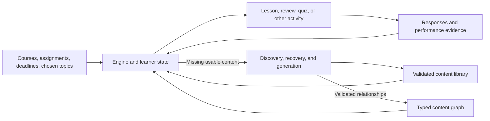

# Math Academy's engine, content graph, and a flexible Course Academy

Analysis date: September 26, 2026.

Follow-up: [schema and architecture evidence](mathacademy_schema_architecture.md) adds direct source/client findings about lesson identities, step versus example/KP identities, question reuse, interactive submissions, and a more concrete table layout. It also narrows the initial product change to student-selected lessons using the same engine.

Math Academy's disclosed design provides a strong foundation for Course Academy: a shared graph of small skills, instructional content attached to those skills, a persistent learner model, and a scheduler that combines new learning with explicit and implicit review. The central mechanism is that solving an advanced problem can exercise simpler skills, allowing some new learning to satisfy review needs at the same time.

The available evidence supports reconstructing that architecture and several important behaviors. It does **not** reveal Math Academy's production database schema, complete FIRe implementation, or exact task-selection function. This report distinguishes those limits from what we can observe and implement ourselves.

Jake's finding that homework- and exam-derived lessons have been substantially better than the ECE pipeline's map-first lessons is a central design input. Course Academy should preserve that problem-driven authoring process while adding the graph, learner state, scheduling, and question supply that turn individual lessons into an ongoing learning system.

**1. Evidence and what each document establishes**

Seven unique requested documents were reviewed; the activity-schema document appeared twice in the request.

| Source | What it contributes | Evidence boundary |
| --- | --- | --- |
| [Proprietary.md][P] | A substantial collection of book excerpts on the graph, diagnostics, FIRe, remediation, task selection, and XP | An AI-assisted excerpt audit dated May 31, 2026; its audit date is not the publication date of every underlying passage |
| [Proprietary-Notes.md][N] | Architectural interpretation, dependency ordering, and suggested entities/edges | Much of it explicitly proposes what we should model; proposed fields are not recovered MA columns |
| [explanation-format.md][E] | One concrete question and its worked algebraic solution | Establishes an explanation example, not a complete item schema or grading policy |
| [answers.md][ANS] | Suggested canonical answer keys and mappings into Obsidian quiz formats | A design proposal; important portions are absent from the inspected capture/render implementation |
| [Active-Learning-Loop.md][LOOP] | Observe → attempt → feedback → mastery → next reachable task | A pedagogical loop without numerical mastery, spacing, or scheduling rules |
| [mathacademy-xp-analysis.md][X] | Question-level observations, candidate XP formulas, counterexamples, and uncertainty | Fits observed awards; it does not recover the serving policy |
| [mathacademy-activity-schema.md][A] | Observed completed-page structure and a proposed export schema | Describes sampled result pages, explicitly not MA's internal database/API |

The analysis also followed references into the original local book, especially the [FIRe technical chapter][FIRE], [diagnostic technical chapter][DIAG], and [practice FAQ][FAQ]. The original FIRe diagrams were inspected to check edge directions and illustrative weights. The earlier excerpt audit had inventoried its figures without reading image-only labels.

The personal-history analysis used the current [progress.csv][CSV], [progress notes][PN], [question-feature observations][OBS], [XP analyzer][SCRIPT], saved analyzer output, and [activity JSON Schema][AS]. Earlier project context is recorded in [skills_v1.md](skills_v1.md), [skills_vs_ece_pipeline.md](skills_vs_ece_pipeline.md), and [ma_inflexibility.md](ma_inflexibility.md).

Throughout this report:

- **Published** means MA describes the behavior in the supplied book or its public documentation. It is a source claim, with possible version differences.
- **Observed** means the local capture/history contains the stated data.
- **Inferred** means a model is consistent with observations but alternatives remain possible.
- **Proposed** means an implementation choice for Course Academy.
- **Unknown** means the evidence does not identify the rule or value.

Public documentation was checked against the local material. MA currently describes its AI as an expert system using a knowledge graph, learner model, diagnostic, and task selector. That supports the overall interpretation; it does not establish that its production scheduling is performed by an LLM. [MA: How Our AI Works](https://mathacademy.com/how-our-ai-works).

**2. The four systems and their interfaces**

The four proposed components are a useful decomposition. Learner evidence and state belong within the engine's responsibilities, with durable storage shared through explicit interfaces.

| Component | Responsibility | Supplies to the others |
| --- | --- | --- |
| Content | Lessons, KPs, examples, questions, solutions, answer keys, assets, and activity blueprints | Versioned instructional and assessable material |
| Graph | Readiness, remediation, actual practice coverage, curriculum membership, and other typed relationships | Reachable topics, dependencies, coverage estimates, and scope |
| Engine/orchestrator | Learner evidence/state, retention, task eligibility/selection, adaptive delivery, remediation, XP, and goals | A task to serve, updates from its results, and requests for missing content |
| Generation/discovery/recovery | Locate usable material, recover missing structure/answers, generate and validate new material, register it | Additional validated content and supported graph relationships |

This is a proposed component boundary, not a claim about MA's deployment architecture.



There are two scheduling scales. The **task selector** decides which lesson, review, quiz, or other activity should be offered. The **activity controller** decides which question comes next, whether a KP needs another question, when an attempt ends, and what feedback is appropriate. A fixed course ordering implements neither of these fully.

The ECE pipeline primarily orchestrates content production. Its stage completion, cached artifacts, and recovery state are build state. They do not represent a student's knowledge, forgetting, attempted questions, or readiness. Its useful production machinery can support component four without becoming the learning engine merely by renaming its stages.

**3. The content model: reusable material versus a student's activity**

MA's conceptual organization is a shared topic graph. Courses select portions of that graph. Topics have lessons; lessons introduce ordered knowledge points, each combining a worked example with closely related active practice. KPs increase the complexity of the same skill in manageable steps. [Knowledge-graph and KP excerpts][P].

| Concept | Relationship and role | Important distinction |
| --- | --- | --- |
| Course | Defines a curriculum scope over topics | A course is not an isolated copy of every topic and learner state |
| Module | Groups related topics within curriculum organization | Membership may inform prediction; it does not prove prerequisite or practice coverage |
| Topic | Identifies a teachable skill and anchors readiness/retention state | A title match alone does not establish equivalent skill coverage |
| Lesson | Provides instruction and staged practice for a topic | A reusable lesson differs from a particular lesson attempt |
| Knowledge point | An ordered case or increment within the lesson | KP identity differs from a displayed group number or a captured document step |
| Worked example | Demonstrates a KP through a prompt and solution | Distinct from a student's answered question |
| Question | A prompt, response structure, grading information, and solution/feedback | Can have several answer slots while receiving one overall grade |
| Question occurrence | A particular delivered question in an activity | Stores the student's response, outcome, order, and timing separately from the reusable question |
| Activity/task | A lesson attempt, review, assessment, multistep, or diagnostic instance | Completion records do not establish mastery |
| Asset/rich content | Equations, graphs, images, HTML, and available source math | Text-only extraction can omit information needed to solve or grade a question |

The original practice FAQ describes **2–5 questions served adaptively per KP**, with typical lessons containing 3–4 KPs. A separate historical inventory describes a bank of 10 or more questions per KP. Bank size and the number served during one attempt are different quantities. Neither establishes current universal counts or how items are generated. [Practice FAQ][FAQ]; [historical inventory][P].

For Course Academy, one topic should be able to have multiple lesson versions or instructional treatments, and one problem may require several topics. Those are useful extensions; the sources do not establish MA's physical table cardinalities. Topic state must reflect the scope actually demonstrated. A narrow homework lesson cannot silently grant credit for all cases of a broad MA topic with a similar name.

**The six observed activity families**

| Activity type | Purpose and delivery | Observed result structure |
| --- | --- | --- |
| Lesson | Learn successive KPs through worked examples and blocked practice | Ordered KP groups containing question/explanation pairs |
| Review | Retrieve previously learned material, mixing cases and checking consistency | Flat question results, with topic/KP links |
| Assessment | Quizzes testing accumulated learning under timed, interleaved conditions | Flat question results; quiz and retake names are visible |
| Multistep | Combine previously learned skills in an ordered problem sequence | Dependent questions with topic/KP links; shared scenario may be absent from the result page |
| Diagnostic | Estimate existing knowledge and gaps for placement | Flat results; title identifies scope; no displayed XP denominator in inspected cases |
| Supplemental Diagnostic | Repair missing diagnostic information after graph changes | Similar result layout to Diagnostic, but a different purpose |

The six labels come from the [activity observations][A]. Their educational purposes are supported by the book where described. The exact scheduling of multisteps is not recovered. A multistep activity, a question with multiple blanks, and a worked solution with several algebraic lines are three different structures.

An early lesson should not automatically become a timed quiz question immediately afterward. The published distinction is between **baseline mastery**, sufficient to build further knowledge, and **automaticity**, expected after additional practice and retention. A short immediate check, a later review, and a broad timed quiz measure different things. [Practice FAQ][FAQ].

**4. The graph contains several different kinds of relationship**

A prerequisite DAG alone is insufficient. It can determine a permissible sequence, but it cannot say which old skills a new task practices, where to remediate a particular failure, or how evidence should affect another course.

The table below uses explicit semantic endpoints. Arrow directions are a proposed storage convention. The original book's encompassing diagram draws arrows from simpler to advanced topics, while the earlier Notes propose advanced-to-simpler edges. Positive credit travels from advanced work toward encompassed skills regardless of how an edge is drawn.

| Relationship | Endpoints/convention | Meaning and engine use | Values or qualifications |
| --- | --- | --- | --- |
| Prerequisite | prerequisite topic → dependent topic | Required readiness for new learning; supports frontier calculation | Exact proficiency threshold is unknown; direct edges differ from transitive ancestry |
| Key prerequisite | KP → prerequisite topic | The especially relevant skill to revisit when that KP repeatedly causes trouble | May reach several prerequisite layers back; distinct from all prerequisites of the lesson |
| Encompassing | advanced topic → encompassed topic | Work on the advanced skill actually practices the other skill | Fractional weight; full, partial, or zero practice coverage |
| Non-ancestor encompassing | advanced topic → another topic outside its prerequisite ancestry | More advanced equivalent treatment supplies practice across graph branches/courses | Directional coverage, not blanket bidirectional equivalence |
| Module association | topic ↔ module ↔ topic | Related-topic evidence helps initial prediction and diagnostic inference | Correlation does not grant ordinary repetition credit by itself |
| Diagnostic coverage | assessed representative → topics it informs | Compresses the number of placement questions needed | Depends on graph structure and diagnostic policy; not a general practice edge |
| Course membership | course ↔ topic | Defines scope, progress reporting, and course priorities | Keep separate from current enrollment and the course label on an activity |
| Content structure | lesson → ordered KP → example/question links | Assembles instruction and associates performance with skill scope | Preserve order, stable IDs, and versioned coverage |

The conceptual relationships are supported by [Proprietary.md][P] and the [FIRe][FIRE] and [diagnostic][DIAG] chapters. The exact table structure above is proposed.

**Prerequisite does not imply encompassing.** Familiarity with a concept may be necessary without practicing its computational procedure. The book's examples include using the eigenvector equation in a proof without computing eigenvectors, and 2×2 matrix diagonalization failing to fully exercise a characteristic-equation topic centered on 3×3 matrices. Assuming every prerequisite receives full repetition credit would systematically overestimate practice. [Practice FAQ excerpts][P].

Encompassing weights are loosely interpreted as the probability that a random advanced-topic problem exercises a random problem from the encompassed topic. This is an explanatory interpretation, not a recovered estimator. One book diagram illustrates integration by parts with weights 1 for polynomial integrals, 0.5 for exponential integrals, and 0.2 for trigonometric integrals. Those are diagram examples, not captured production edge records. [FIRe chapter][FIRE].

Experts specify important nearby encompassing weights; other relationships are inferred through the graph. Explicit weights can correct inferred relationships, and absent/uninferred coverage is treated as zero in the description. The exact method for combining multiple paths, preventing duplicate credit, and handling cycles is undisclosed. It would be unjustified to choose multiplication, addition, maximum-path, or capped-union rules and call the result recovered FIRe.

For our graph, every relationship should have a type, semantic endpoints, provenance, version, and validation status. Coverage strength and confidence in that strength are separate values: `weight = 0.5` means partial practice, not 50% confidence that the edge exists. Inverse postrequisite queries and ancestry can be derived rather than maintained as conflicting copies. Prerequisite cycles need validation; other relationship types should not inherit DAG assumptions automatically.

Two other concepts belong in the model without becoming ordinary dependency edges. **Core status** is a prioritization attribute: MA describes a proprietary identification algorithm with ancestor-closed core status and a meaningful balance of core/supplemental topics. **Mastery floors** are a historical course policy that assumes some sufficiently low topics remain mastered. A floor is an assumption, not new evidence of knowledge; the source discusses it as a shortcut with possible future replacement. [Core-topic and mastery-floor excerpts][P].

**5. What the engine knows about a learner**

The published design maintains information per learner and topic. It combines placement evidence, subsequent performance, repetition history, and estimates of retention and learning speed. A Boolean `completed` field cannot represent this.

| State concept | Supported meaning | Proposed implementation consequence |
| --- | --- | --- |
| Diagnostic evidence balance | Signed evidence of known versus unlearned material; magnitude indicates confidence | Preserve underlying assessment evidence and inference provenance |
| Conditional completion | Weakly supported credit that can be revoked more readily | Distinguish provisional knowledge from strong repeated evidence |
| Baseline mastery/readiness | Sufficient consistent performance to support further learning | Separate activity completion, KP coverage, topic readiness, and automaticity |
| Recent accuracy/ability estimate | Recency-weighted performance, including relationships to other topics | Preserve context and model version; do not equate XP with accuracy |
| Learning speed | Individual performance adjusted for topic difficulty | State can differ across topics for the same student |
| Repetition progress | Accumulated progress through spaced repetition | Can increase fractionally and decrease after failure |
| Memory estimate | Expected present retention after elapsed time | Review can become due without any new completed activity |
| Failure/remediation history | Repeated trouble at a particular KP or topic | Drives focused remediation and retry handling |
| Enrollment/goals | Course scope and priorities | Keep external deadlines separate from evidence of knowledge |

The published concepts do not disclose all stored fields. Names such as `next_due_at`, `remediation_priority`, or `equivalent_group_id` in [Proprietary-Notes.md][N] are suggested implementation fields.

For Course Academy, keep an append-only learner-event history and rebuildable state estimates. Store the graph, content, and model versions that produced an inference. This supports correcting an erroneous answer key or graph edge without rewriting what the learner actually did. Imported MA observations and locally computed mastery remain separate, attributable records.

**6. Diagnostic placement and the bridge into repetition state**

The diagnostic assesses the selected course and relevant foundations. It selects informative questions and uses graph relationships to infer more knowledge than it directly tests.

The disclosed process includes:

1. Maintain a signed evidence balance for topics. A default answer contributes weight one, with reduced positive evidence for excessively slow correct answers.
2. Correct answers support the assessed topic and prerequisite ancestry. Incorrect answers count against the topic and dependent descendants.
3. Use additional, looser correlations to avoid explicitly assessing everything. A representative leaf topic can provide evidence about other leaf topics in the same module.
4. Stop with evidence covering the needed graph region and identify remaining knowledge gaps. Some positive but weak evidence produces conditional completion.
5. Initialize repetition progress from placement evidence: the original diagnostic chapter states that positive balances become credited repetition counts.

The balance-to-repetitions rule is particularly useful and is clearer in the [original chapter, line 66](</home/jake/Developer/MA/DATA/The Math Academy Way/V-TECHNICAL-DEEP-DIVES/30-Technical-Deep-Dive-on-Diagnostic-Exams/30-Technical-Deep-Dive-on-Diagnostic-Exams.md:66>) than in the excerpts. Exact distance weights, inference aggregation, timing penalties, and stopping thresholds remain unknown.

The text describes compressed diagnostic coverage requiring each covered topic to have both an ancestor and a progeny in the compressed diagnostic graph, each within three prerequisite edges of that topic. Treat that as a disclosed policy in that source version, not an eternal graph constant. The diagnostic frontier is described as conservative, while the frontier used to layer new learning can be more aggressive. Passing a lesson and demonstrating comprehensive placement-level fluency are not identical thresholds. [Diagnostic chapter][DIAG].

Diagnostic items must cover the intended skill convincingly. The goal is a simple question that establishes the relevant mastery and exercises its prerequisites, rather than an arbitrarily difficult calculation or merely the easiest KP.

Supplemental diagnostics address missing evidence after graph changes. The original description identifies topics not directly tested in the initial diagnostic that now have zero balance after considering all assessment answers since and including that diagnostic. Poor performance by itself is not the stated trigger. This differs from remedial review, a quiz, or a voluntary fresh placement exam. [Diagnostic chapter][DIAG].

**7. FIRe: retention updates, fractional practice, and forgetting**

Fractional Implicit Repetition combines spaced repetition with the observation that advanced work practices component skills. Its disclosed mechanisms include partial practice credit, timing discounts, learner-topic learning speeds, backward movement after failures, and review compression.

The original technical chapter gives the following **high-level equations**, using its variable names:

```text
repNum → max(0, repNum + speed × decay^failed × rawDelta)
memory → max(0, memory + rawDelta) × (0.5)^(days / interval)
```

| Variable | Meaning in the source |
| --- | --- |
| `repNum` | Accumulated successful spaced repetitions on the topic |
| `interval` | Desired spacing between repetition `repNum` and `repNum + 1` |
| `days` | Elapsed days since the previous repetition |
| `memory` | Estimated current retention; sufficiently low memory makes review due |
| `rawDelta` | Signed repetition credit: positive for success, negative for failure; magnitude reflects performance and early timing discount |
| `speed` | The learner's learning speed on this topic |
| `failed` | One for a failed repetition, zero for a passed repetition |
| `decay` | Backward-speed multiplier, starting at one and growing with severe overdue forgetting |

Source: [FIRe chapter, high-level structure](</home/jake/Developer/MA/DATA/The Math Academy Way/V-TECHNICAL-DEEP-DIVES/29-Technical-Deep-Dive-on-Spaced-Repetition/29-Technical-Deep-Dive-on-Spaced-Repetition.md:133>).

These equations are explanatory, not executable specifications. They do not specify the interval function, due threshold, initial memory, update ordering, or how to refresh memory between events. Reapplying elapsed time to an already-decayed value without an explicit reference timestamp, for example, could incorrectly count forgetting twice. The displayed memory variable is not shown to be a calibrated probability with a mandatory upper bound of one.

**Credit propagation has an important asymmetry.** Successful advanced work supplies positive evidence to encompassed simpler topics. Failed simpler work supplies negative evidence to advanced topics that depend on exercising that component skill. Both can propagate through multiple layers. Failure on an advanced problem does not by itself establish that every prerequisite was failed. Targeted remediation uses additional information about where the learner struggled. [FIRe chapter][FIRE].

Early practice receives discounted repetition credit. Partial encompassings further limit how much another topic benefits. For a schematic illustration, work with an encompassing weight of 0.5 cannot be treated as an automatic full, on-time explicit review; the actual credit also depends on timing, performance, and the unspecified combination rules.

Learning speed is described as an ability speedup divided by a topic-difficulty slowdown. Ability uses recent accuracy; initial estimates draw on related topics. Difficulty uses aggregate assessment performance. The exact mapping functions and recency weights are not supplied. A particularly concrete disclosed rule is that **incoming implicit credit is disabled for a learner-topic speed below one**, requiring explicit practice for that topic. [Spaced-repetition excerpts][P]; [FIRe chapter][FIRE].

Severe overdue failure can reduce repetition progress more sharply through `decay`. That accommodates relearning after long forgetting, rather than treating every mistake as the same small scheduling adjustment. Inactivity alone and an observed failed retrieval are different evidence and should remain distinguishable.

**8. How the engine decides what to serve**

The following is a conceptual reconstruction from the published descriptions, not a recovered sequence of production functions:

1. Read current learner evidence, refresh retention estimates, and determine which topics need practice.
2. Find the knowledge frontier: unlearned topics with sufficient prerequisite proficiency.
3. Construct candidates: frontier lessons, explicit reviews, applicable remediation, eligible quizzes/retakes, and other supported activity types.
4. Estimate how candidates cover review needs and open useful future learning.
5. Offer a changing menu of valuable tasks, execute the selected activity, and adapt its questions to performance.
6. Record results, update learner state and XP, apply remediation rules, and recompute the menu.

The MA dashboard is explicitly described as a **dynamic menu**, not a fixed queue. MA says it suppresses a review when an offered lesson makes that review redundant. Completing one task can therefore change which reviews or lessons remain offered. It is not a universal policy of clearing every review before allowing new learning. [Task-selection excerpts][P].

Repetition compression aims to cover due practice with fewer tasks while producing useful repetition gains throughout the profile. Forward progress can open new ways to satisfy old review needs. Sometimes a not-yet-due advanced review can cover an older due review; its own early practice earns discounted credit. The book also emphasizes maintaining breadth in the frontier so future compression remains possible. [FIRe and efficiency excerpts][P].

This resembles an optimization problem over task coverage, prerequisites, and costs. The exact objective, candidate pruning, coefficients, tie breaking, and solver are undisclosed. The phrase “smallest possible task set” is a stated design objective, not evidence that MA runs a particular set-cover algorithm or guarantees a global optimum.

Core-topic importance and downstream unlocks influence priority, alongside review coverage and other factors. This mathematical-curriculum importance differs from a student's immediate assignment deadline. Course Academy can preserve retention/readiness calculations while adding that missing priority input.

The Notes' separation between a FIRe state updater and a compression selector is useful for our implementation. MA's descriptions also include compression within FIRe's broader capabilities. Those descriptions do not establish separate internal services. [Proprietary-Notes.md][N].

**Question selection, quizzes, retries, and remediation**

MA's current public explanation describes up to five practice questions with two consecutive correct answers advancing the lesson, and quizzes becoming available every 150 XP. It also describes targeted reviews after quiz errors and an optional retake after adequate practice. These are public behavior claims, not recovered counters or complete policies for all historical versions. [MA: How It Works](https://mathacademy.com/how-it-works).

The technical public page describes quiz sampling from previously learned material, favoring the enrolled course and reducing priority for topics already quizzed or encompassed by other quizzable topics. [MA: How Our AI Works](https://mathacademy.com/how-our-ai-works). The local FAQ says the pool extends beyond topics learned since the previous quiz, after sufficient practice to expect automaticity. The public phrase “recent topics” should therefore not become an implementation assumption that older learned material is ineligible. [Practice FAQ][FAQ].

The book discloses repeated failure at the same KP as a remediation signal: two failed lesson attempts at that point prompt reviews of its key prerequisites. Failed remedial reviews can bring back corresponding lessons. Weak conditional knowledge can be rolled back more readily than strong historical evidence. Failed attempts can have retry delays and new questions while independent branches remain available. [Remediation excerpts][P].

The described 80–85% quiz-accuracy target concerns quiz difficulty calibration. It is not evidence for an 80% lesson pass mark. Nor do two consecutive correct answers constitute a recovered universal mastery rule for every activity type.

**9. What Jake's personal progress actually shows**

The current CSV contains **217 distinct completed tasks**, spanning displayed local times from February 27, 2025 at 11:13 through September 24, 2026 at 17:05, across 49 dates with completions.

| Type | Current completed tasks |
| --- | ---: |
| Lesson | 133 |
| Review | 53 |
| Assessment | 13 |
| Multistep | 10 |
| Diagnostic | 6 |
| Supplemental Diagnostic | 2 |
| **Total** | **217** |

These counts differ from the earlier reports because the files represent different snapshots. `progress-notes.md` describes 212 rows; the XP analysis describes 214. The current CSV adds two September 24 reviews and Quiz 4 (Retake) to the 214-row snapshot. Removing its three newest rows exactly reproduces the older CSV hash stored with the XP observations. The 17-task completed-page study overlaps the 34-task question-feature dataset; their sample counts must not be added as independent observations. [Progress notes][PN]; [XP observations][OBS]; [CSV][CSV].

There are several informative completion sequences:

| Sequence | Observed activities | Interpretation and limit |
| --- | --- | --- |
| Harmonic Series and p-Series, topic 860 | July 29: lesson `12034755`, 9/7 XP → August 5: review `12225753`, 0/4 → same day: lesson `12228527`, 9/7 → August 6: review `12253898`, 6/4 | Consistent with remedial relearning after weak retrieval, followed by renewed practice; the initiating decision is not logged |
| August 5 quiz and retake | 12:01 Quiz 1 `12225370`, 0/11 → lesson → five reviews → lesson → 13:58 Quiz 1 (Retake) `12228526`, 13/13 | Practice occurred between quiz and retake; completion history does not prove every intervening task was mandatory |
| September 24 quiz and retake | 11:25 Quiz 4 `13553418`, 10/15 → reviews `13675888`, `13675890`, `13675889` → 17:05 retake `13682227`, 18/15 | Repeats the practice-before-retake pattern; the latest retake lacks question-level features in the fitted sample |
| Riemann sums, topic 1042 | August 21: lesson `12601433`, −1/14 → August 22: lesson `12722019`, 18/14 → September 4: review `13124977`, 9/7 | A completed lesson can have poor performance and later reappear; completion cannot be equated with mastery |

Source: [chronological activity records][CSV]. In the September sequence, task `13675890` completed before `13675889`: task IDs are identifiers, not reliable completion-order keys. Retakes have distinct task IDs; the pair relationship is inferred from labels and chronology, not an exposed `retake_of` field.

The 53 reviews cover 40 topics. Thirty-six have an earlier observed lesson on that topic, while 17 do not. That does not mean the system reviewed unknown material: diagnostic credit, earlier history, or other evidence may account for eligibility. Among 42 reviews with an earlier same-topic lesson/review, observed completion gaps range from 24 minutes to 463.05 days, with a median of 12.67 days. **Those are completion gaps, not recovered review intervals.** They omit implicit practice, hidden due dates, and the effects of inactivity or incomplete history.

Course attribution also matters. During the probable Calculus II enrollment period, July 14–August 18, the 79 lesson/review rows include 20 labeled CA2, 23 CA1, 21 Precalculus, and 15 Algebra II. This is consistent with work across prerequisite courses. The enrollment period itself is inferred. Some identical topic IDs appear under different course labels at different times, reinforcing the need to separate global topic identity, course membership, and historical enrollment. [Attribution rules and timeline][PN].

The record does not identify offered alternatives, rejected candidates, abandoned attempts, exact start times, due dates, or hidden learner state. It cannot tell whether a task was offered because it was due, remedial, useful for compression, selected by the learner, or favored by a changed enrollment. Consequently, several schedulers can explain the same completion order.

Dates need provenance. CSV times do not establish a timezone. Diagnostic `4748206` has a January 9, 2026 feed date but question displays showing “Thu, Jun 5th” without a year. Preserve that disagreement rather than repairing it with an invented timestamp. [Activity-schema date limitations][A].

**Quiz cadence cannot be read directly from completion gaps.** Between nonretake quizzes during the inferred CA1 period, September 4–17, fifteen routine activities earned 120 XP; including the preceding quiz's 12 XP gives 132. During the inferred CA2 period, August 5–8, routine activities earned 181 XP between quizzes. These do not establish exact 150-XP completion blocks. They also do not falsify the public availability rule: offer timing, counter initialization, included XP categories, carryover, and enrollment effects are unknown. Retakes are especially different; the September 24 quiz and retake had only 16 earned review XP between them. [CSV][CSV].

**10. XP: useful empirical models, separate from mastery and serving**

MA describes XP as expected productive work for an average serious student, approximately calibrated to focused minutes. It is not a timer of the individual student's actual session and not a count of mastered topics. Bonuses and penalties reflect performance; the displayed denominator is a baseline workload, not a maximum attainable score. [Gamification and XP excerpts][P].

The retained question-feature dataset covers 34 activities and 308 question occurrences: five lessons, six reviews, twelve assessments, six multisteps, three diagnostics, and two supplemental diagnostics. All 34 task IDs, awards, and displayed bases agree with the current CSV. The existing exact-rational analyzer was inspected and rerun read-only; its fitted assessment and multistep predictions still match the saved observations. [XP analysis][X]; [observations][OBS]; [analyzer][SCRIPT].

Let `B` be the displayed baseline, `p = correct / observed_questions`, and `R(x) = floor(x + 1/2)`.

| Family | Empirical candidate | Evidence and limit |
| --- | --- | --- |
| Assessment | `max(0, R(1.2 × B × (p − 0.35) / 0.65))` | Exactly matches 12/12 retained assessments; revised using the sample, so this is a fitted hypothesis rather than independent validation |
| Multistep | `R(B × (2.25 × p − 1))` | Exactly matches 6/6 retained multisteps; two were checked after choosing the candidate; low-accuracy negative behavior remains untested |
| Lesson | Candidate upper award `R(1.25 × B)` | 89/133 current lesson awards equal it; none exceed it; partial-credit/stopping behavior remains unresolved |
| Review | Candidate upper award `B + 2` | 38/53 current review awards equal it; none exceed it; observed base values are too narrow to identify a universal bonus rule |
| Diagnostic / Supplemental Diagnostic | Unresolved | No displayed denominator in inspected results; accuracy and elapsed time alone do not identify the awards |

For current assessments, 4/13 equal the candidate perfect-score ceiling `R(1.2B)`; for multisteps, 5/10 equal `R(1.25B)`. Those aggregate matches do not establish perfect correctness for uninspected tasks. The newest retake's 18/15 award is a ceiling match, not a thirteenth question-level validation of the assessment formula.

The exact rounding matters: the candidate uses `floor(x + 1/2)`, not Python's default ties-to-even `round`. Even exact matches leave competing formulas possible. The assessment zero-crossing is only constrained to a range around 35% by this sample, and the multistep slope is not uniquely determined by rounded observations. The low-accuracy regions are particularly weakly identified. [Model limits][X].

Lesson and review results demonstrate why a single accuracy-to-XP rule is insufficient. A lesson contains KP sequences such as `CC`, `CICC`, `ICC`, and `CICC`. Another has `CC`, `ICC`, `CC`, and `CICIC`, where the final group reaches five questions without consecutive correct answers. This is consistent with adaptive practice and a bounded stopping outcome; it does not prove mastery of every completed group. Reviews with the same overall three-correct/two-incorrect count can receive different awards. [Adaptive-history observations][X].

The earlier hypothesis that difficulty labels E/M/H simply contribute weights 1/2/3 to the displayed baseline failed additional examples. Actual elapsed time is also not a reliable substitute for expected workload. Keep authored/calibrated expected effort, question outcomes, elapsed time, and XP as separate measurements.

Gamification can consume XP events for goals and leagues. The local book describes weekly competition and performance incentives, but the full league-assignment and award rules are not recovered. Estimated completion dates also depend on changing remaining work and recent XP/day; they are not fixed course lengths. [XP and practice-schedule excerpts][P].

For Course Academy, preserve imported `xp_earned` exactly. Store candidate predictions separately with a model version. Give locally generated activities an explicit local XP policy and provenance. Neither a high award nor progress toward a weekly XP target should directly manufacture mastery or erase a missed KP.

**11. The observed export schema and its extraction traps**

The existing activity schema is a useful ingestion contract. Its strongest design choice is separating the activity from ordered question occurrences and letting lesson groups refer to those occurrences. It should remain a representation of observed history, with optional/missing fields preserved. [Activity schema][A]; [companion JSON Schema][AS].

| Record | Identity and principal fields | What the evidence supports |
| --- | --- | --- |
| Activity | `task_id`, literal activity type/name, raw status, completion fields/provenance, XP fields, optional course/topic links | Task IDs are strings; status is observed completion; denominator can be null; earned XP can be negative or exceed the baseline |
| Question result | `(task_id, occurrence_index)`, separate `question_id`, prompt, result, difficulty, timing, optional submitted response, explanation, topic/KP link | Occurrence identity is safer than assuming a reusable question ID uniquely identifies every result |
| KP group | Task/group index, displayed title, ordered occurrence references | Group number/title do not supply a verified MA KP ID |
| Answer part | Question-local position, displayed input value, optional student-response evidence | Multiple blanks can have one question-level outcome; per-part grading is not established |
| Rich content | Source HTML, normalized text, available TeX/MathML, assets and layout information | Preserve information required to understand and render the question |
| Source observation | Source URL, capture time/scope, selectors or field origins, missingness | Distinguishes direct observation, extraction, normalization, and inference |

The source field named `xp_possible` means the displayed denominator in this export. A canonical model should expose it as something like `xp_baseline`, retaining the original field and provenance, because it is demonstrably not a maximum possible award.

Several extraction details can materially corrupt learning evidence if ignored:

- A completed page's inline textbox may display a corrected answer. One incorrect result shows `+2/3` inline while the separate student response is `−2/3`. Store displayed and submitted answers separately.
- An absent submitted-response block is missing information. It is not proof that the learner submitted nothing. Conversely, a displayed “No answer” does not establish why no answer was recorded.
- Original multiple-choice option lists can be missing from completed pages. A solution graph does not reconstruct all distractor graphs.
- Question/explanation pairs are sibling elements, with explanations loaded but collapsed in the inspected pages. Repeated DOM input IDs are question-local, so extraction must be scoped.
- Some assessment question timestamps mirror the overall completion timestamp. They cannot establish individual response chronology. Elapsed-time displays may have different pause semantics.
- The sidebar's current course is not evidence of a completed task's historical enrollment. The task's own label and catalog joins have different provenance.

These are documented in the [completed-page observations][A]. The permissive JSON Schema can validate shape while still admitting incomplete extraction, wrong answers, or a mistaken course attribution. Schema validity does not establish semantic correctness.

A further join issue appears in the current capture code. `Questions.csv` associates a question with the most recent preceding document step; that is a derived relationship. Completed flat results can supply an explicit topic/KP URL. Key-prerequisite records connect a step to prerequisite **topics**. Those are different facts. Verify step-to-KP correspondence through source anchors/IDs before merging them; ordinal position or matching titles alone is insufficient. [Question association code](</home/jake/Developer/MA/PIPELINE/Math-Academy/3-Capture/2-Lesson-Data/3-Questions/questions.py:151>); [capture contract](</home/jake/Developer/MA/PIPELINE/Math-Academy/3-Capture/capture.md:182>).

**Answer recovery is still an implementation gap.** The requested `answers.md` proposes a nested `answer_key` and an explicit missing-answer status. The inspected `lesson-json.py` emits content, choices, and input slots without that canonical answer key or question explanation. The Markdown renderer reads top-level aliases/per-choice flags rather than the proposed nested object. The dedicated `WORKING-PROGRESS/Answers/answers.py` and sibling Markdown file are empty placeholders. [Answer proposal][ANS]; [JSON builder](</home/jake/Developer/MA/PIPELINE/Math-Academy/3-Capture/1-Source/3-JSON/lesson-json.py:1269>); [renderer](</home/jake/Developer/MA/PIPELINE/Math-Academy/3-Capture/1-Source/5-MD/md.py:1371>).

Two parts of the proposal need correction when implemented. `require_exact: false` in the current study quiz contract means answer reveal without grading; it does not provide automatic non-exact mathematical grading or mastery evidence. Also, a source `select-list` can represent multiple answer positions with separate option banks. The study renderer distinguishes `select` with a shared bank from `multi-select` with separate banks; the current MA renderer instead emits one `select` block per source dropdown. Preserve those answer positions and banks when choosing a renderer. [Quiz grading contract](</home/jake/Developer/study/util/skills/quiz-block-factory/references/quiz-block-schema.md:254>); [MA dropdown renderer](</home/jake/Developer/MA/PIPELINE/Math-Academy/3-Capture/1-Source/5-MD/md.py:1479>).

**12. A canonical schema we can implement**

This section is a **proposed Course Academy logical schema**, derived from the supported concepts. It is not a claim about MA's internal tables, storage technology, field names, or API. Keep the raw export as an ingestion layer and promote reconciled, validated information into this model.

| Entity | Suggested fields and relationships |
| --- | --- |
| `SourceRecord` | Local ID; source namespace and source ID; URL/path; capture time; content hash; raw artifact; extraction version; field provenance |
| `Topic` | Stable local ID; source mappings; title; explicit skill scope; domain; version; validation status |
| `Course`, `Module`, `CourseTopic` | Curriculum identity/version; topic membership; organization/order; course-specific relevance/core attributes |
| `LessonVersion` | Stable lesson ID and version; taught topic/KP scope; ordered content blocks; source problem references; validation state |
| `KnowledgePoint` | Stable local ID; parent topic; case/skill definition; lesson ordering links; baseline evidence requirements chosen by our policy |
| `Example` | Prompt, worked solution, assets, KP links, content version |
| `Question` | Stable ID/version; prompt; response schema; answer slots/options; answer key; explanation/feedback; primary assessed KP and other exercised skills; expected effort |
| `QuestionFamily` | Generator ID/version; parameter schema and constraints; solution/checker implementation; supported KP scope; variation dimensions; calibration status |
| `QuestionInstance` | Question/family reference; generator version and seed/parameters when applicable; immutable rendered content and key hash |
| `AnswerKey` | Canonical response by stable slot/option ID; grading method; domain/tolerance rules; provenance; verification status |
| `Asset` | Content hash, location, media type, dependencies, and alternative text/context where appropriate |
| `GraphEdge` | Type; named semantic endpoints; weight where meaningful; explicit/inferred status; evidence/confidence; graph version; validation state |
| `ActivityBlueprint` | Kind; intended KP/topic coverage; teaching/retrieval/testing conditions; selection and stopping policy; timing; question requirements |
| `ActivityAttempt` | Learner; source task ID where present; blueprint/content versions; offered/start/completion observations; local lifecycle; ordered occurrences; outcome |
| `QuestionOccurrence` | Attempt and occurrence index; immutable item instance; submitted-response evidence; correctness; feedback/hint exposure; timing; grader version |
| `LearnerEvent` | Immutable event ID; learner; time and provenance; activity/occurrence; event kind; evidence source; affected skill scope |
| `LearnerTopicState` | Learner/topic; evidence balance; conditional status; readiness estimate; accuracy/speed; repetition progress; memory reference state/time; failure history; model version |
| `LearnerKPState` | Evidence/coverage within a topic and focused failure history; our extension where finer tracking is useful |
| `XPEvent` | Source award or local award; baseline; reason/policy version; linked activity; separate predicted award if analyzing MA |
| `Enrollment`, `StudyGoal` | Active course scopes; assignment/problem targets; deadlines; learner priorities and time budget |
| `SchedulerDecision` | Decision time; goal/state/graph versions; eligible candidates; offered tasks; rankings/reasons; coverage estimates; learner selection |
| `ProvisioningRequest` | Missing skill/content type; required question supply; target scope; constraints; source candidates; generation/recovery status and artifact references |

The proposed schema deliberately separates a reusable question from a generated instance and its delivery. We have not established that MA has parameterized question families, so captured questions need not have a family ID. Identical content can occur in several activities without overwriting earlier responses.

A few invariants connect these records:

1. Source IDs stay in a source namespace; locally generated content receives local IDs. A mapping asserts a reviewed correspondence, not identity by title.
2. Every locally graded occurrence resolves to the exact item, answer key, and grader used at that time. Imported outcomes preserve observed results while unavailable original keys and graders remain unknown. Correctness flags derived for local rendering must agree with the canonical key.
3. Missing keys make an item unavailable for automatic assessment. It may remain usable as reference material or a clearly ungraded exercise.
4. One delivered response produces one direct evidence event. Any propagated credit records its graph/model provenance and avoids counting the same observation twice.
5. Readiness, review eligibility, automaticity, and activity completion remain separate states. An unavailable field remains unknown; an explicitly observed nonresponse retains its recorded outcome.
6. The learner has one shared topic history across concurrent courses, with course-specific scope and priority views.
7. Graph and content changes are versioned. Recomputing an inference does not alter an original response or imported XP award.

This model supplies the missing connection between content production and learning. A generated Markdown lesson alone cannot support retention scheduling until its taught scope, assessable KPs, item supply, grading, and learner events are registered.

**13. Content discovery, recovery, and generation**

This fourth component should respond to a precise demand from a lesson author, user goal, or scheduler. “Need a review of KP X with unfamiliar valid questions” is actionable. “Generate more calculus” does not specify what evidence the result should produce.

A provisioning request should distinguish missing instruction, missing questions, missing answers, missing diagrams/context, uncertain topic correspondence, and missing graph relationships. Those gaps require different work.

| Mechanism | Appropriate work | Result that can enter the learning system |
| --- | --- | --- |
| Discovery/reuse | Find already available lessons, items, examples, and assets matching the required skill scope | Preserved source material with verified correspondence and provenance |
| Recovery | Reconstruct omitted structure or derive a missing answer from sufficient source information | A derived field with evidence and validation, distinct from directly captured data |
| Python generation | Parameterized mathematical families, answer calculation, controlled distractors, deterministic diagrams, grading, and mechanical checks | Reproducible instances with validated constraints, solutions, and stable identities |
| LLM assistance | Interpret school problems, identify core moves, propose meaningful variations, draft instruction/feedback, and resolve ambiguous coverage hypotheses | Draft content/relationships requiring appropriate mathematical and semantic validation |
| Registration | Connect accepted artifacts to topics/KPs, assets, indices, graph versions, and activity blueprints | Content the engine can actually find, deliver, grade, and revisit |

Existing captured material is a starting supply, not evidence that the entire MA library or future question bank is locally available. A completed result page can sometimes recover information absent from lesson capture, but one worked solution does not reconstruct every original option, response slot, or assessment context. Where recovery is insufficient, generate a new local item rather than mislabeling an invented reconstruction as the original.

The proposed workflow builds on the successful study skills:

```text
Actual assignment/exam problem
  → identify required moves and cases
  → match existing instruction at the same scope
  → generate uncovered instruction
  → refine pedagogy, feedback, and prose
  → validate mathematics and interactive questions
  → register taught/assessed KPs and graph relationships
  → build additional review and assessment supply
  → serve activities and collect learner evidence
```

Use the course map to organize coverage, find omissions, and reconcile relationships as content grows. Jake's experience supports retaining problem-grounded authoring; it does not isolate the causal contribution of source problems versus the skills' additional refinement and feedback passes. The earlier comparison found both differences. A source problem also covers only part of a curriculum, so mapping and explicit gap detection remain necessary.

The ECE pipeline's persisted stages, structured intermediate artifacts, generation recovery, and figure tooling remain useful here. The study skills' source fidelity, narrow core moves, response-specific feedback, refinement, and final validation should govern instructional quality. The previously observed registration gap also needs an explicit owner: successful generation must make the result discoverable in the library and usable by the engine. [Skills review](skills_v1.md); [pipeline comparison](skills_vs_ece_pipeline.md).

**A concrete programmatic question family**

The supplied explanation solves an intersection problem involving `y = −2x² − 2x + 1` and `y = −11`, with ordered roots `x₁ < x₂`, then asks for `x₁y₂`. Its solution gives roots −3 and 2 and answer 33. It contains a coherent whole-question derivation, but not separate explanations for every distractor. [Explanation example][E].

A proposed Python family can construct:

```text
y = a(x − r1)(x − r2) + h
y = h
constraints: a ≠ 0 and r1 < r2
requested quantity: x1 × y2 = r1 × h
```

Render the first equation in expanded form if factoring is the targeted move. Choose parameters within a stated number domain and difficulty range. Generate explanations from the same immutable instance parameters, then independently verify expansion, root substitution, ordering, and the requested product. Generate distractors from meaningful errors, rejecting duplicates or accidental correct choices. Parameter constraints must also prevent degenerate cases that remove the intended reasoning.

This is our generator design, not a recovered MA template. It can supply new numerical instances cheaply. It does not automatically supply new conceptual structures. Assessment coverage may also need different representations, cases, or contexts that exercise the same KP without copying the lesson example's recognition cues.

**Requirements for extra questions to support reviews and tests**

Each family or vetted item should state its assessed KP, exercised subskills, valid domain, variation dimensions, response format, expected effort, solution, grading method, and validation status. Keep delivered-instance history so immediate retries and later assessments can use genuinely distinct items.

For computable mathematics, generate and check answers with appropriate arithmetic/symbolic/numerical methods. Grading needs explicit rules for equivalent expressions, restricted domains, units, rounding, tolerances, and significant figures where relevant. A string comparison is insufficient for many mathematical answers; an LLM's approval alone is insufficient evidence that a computable answer is correct.

Independent checks should test the mathematical property, not merely rerun the same expression that produced the answer. For example, substitute a proposed solution into the original equations, or verify an ODE solution and its initial conditions. Symbolic or numerical checks also have limits; branch conditions, singularities, and physical assumptions need explicit treatment.

Use LLMs for the ambiguous work: what a problem teaches, which case progression is coherent, what misconception a distractor diagnoses, or whether a new engineering context preserves the intended move. Python can enforce many contracts, but it cannot mechanically establish all pedagogical coverage or conceptual correctness.

Assessment assembly needs a blueprint: target scope, KP coverage, conditions, difficulty, approximate effort, and novelty constraints. Immediate practice, delayed review, diagnostic placement, and timed testing should not all pull items with identical cues and requirements. A finite bank or failed generator request is a real content-availability constraint; it should not silently become a claim of readiness or an excuse to reuse a memorized answer as fresh evidence.

Content analytics can later identify ambiguous questions, weak distractors, unexpectedly difficult KPs, and inaccurate expected-time estimates. Sparse local data should be labeled uncalibrated; one learner's performance cannot uniquely separate item difficulty, prior knowledge, guessing, fatigue, and instructional quality.

**14. A flexible engine can preserve the learning model**

The flexibility problem is primarily about scope and priority. MA already offers some choice within its dynamic menu; the missing capability Jake describes is directing the destination, coordinating school deadlines, and maintaining several active course goals. Its adaptation continues after placement, but it does not supply the target-level control needed for his program. This refines the earlier problem statement without diminishing it. [MA agency discussion][P]; [user requirements](ma_inflexibility.md).

Course Academy can use the same shared learner evidence for Vector Calculus II, Applied Differential Equations, and Linear Algebra. A skill practiced in one course can support another when the graph justifies that transfer. Course membership alone should neither duplicate progress nor imply that all topics in the course are mastered.

Consider the urgent u-substitution example:

1. Jake selects the actual assignment problems and a near-term target. The system identifies the required u-substitution cases rather than assuming every case in a broad topic is immediately needed.
2. It computes the relevant prerequisite closure and compares it with current learner evidence. If two or three prerequisites are missing, it prioritizes those gaps. Uncertain knowledge can be checked with suitable questions instead of automatically assigning a complete foundation course.
3. It serves available instruction or provisions a focused problem-derived lesson. Existing known prerequisites are credited only to the extent supported by evidence.
4. During the lesson, it records KP-level attempts, outcomes, and assistance. Passing a narrow scope establishes evidence for that scope, not the rest of the topic by association.
5. That learning immediately enters the local retention model at its actual event time. Subsequent relevant practice can supply justified implicit credit; otherwise the engine can schedule explicit retrieval.
6. The question supply component prepares unfamiliar review items and representative assessment items. Assessment eligibility follows the chosen purpose: an immediate understanding check differs from a later automaticity test.
7. If a later review or test reveals trouble, the engine revisits the implicated KP or key prerequisite. The assigned deadline changes priority, not the recorded correctness of earlier work.
8. Other active courses retain their goals and review needs. The scheduler balances the urgent path with retention and workload, and explains the next task's relation to the student's goals.

This answers the early-lesson concern: **the local engine does not need MA to have scheduled a lesson before it can schedule future practice on that lesson.** It needs registered skill coverage, trustworthy performance evidence, and enough valid items to assess retention. Local learning updates the local state; it does not update MA's private learner model automatically.

We should distinguish choosing a different *ready* topic from previewing an *unready* topic. Both can be supported, but a preview does not become a mastery claim merely because the student wants to see it. Similarly, postponing a due review may be a legitimate student choice without changing the retention estimate to pretend that review happened.

The student's assignment can reveal a missing or overly broad prerequisite edge. The system should support correcting the graph with evidence. It should not require unquestioning adherence to an inferred edge, nor remove an actual prerequisite just because a deadline is close.

**15. What can be reproduced, and what remains a chosen policy**

We can implement a coherent MA-inspired reference engine from these sources, then compare it with a flexible selector using the same content, graph, and learner-state machinery. Calling the reference an exact clone would overstate the evidence.

| Mechanism | What is supported | What remains unknown or must be chosen locally |
| --- | --- | --- |
| Readiness/frontier | New learning depends on prerequisite proficiency | Numerical thresholds, exceptions, and exact handling of partial KP coverage |
| Placement | Adaptive graph inference, signed balance, conditional completion, positive balances seeding repetitions | Question-choice objective, propagation weights, time discounts, stopping details |
| FIRe state | Fractional implicit credit, early discount, individualized speed, memory decay, stronger overdue setbacks | Interval curve, due threshold, initialization, `rawDelta`, speed/decay functions, event ordering |
| Graph propagation | Weighted encompassings with different positive/negative flow directions | Multipath aggregation, deduplication, cycle handling, and production weights |
| Compression | Prefer tasks covering reviews while enabling useful forward progress | Exact optimization objective, candidate pruning, solver, and tie breaking |
| Remediation | Repeated KP failure can lead to key-prerequisite reviews and relearning | Other trigger details, exact cooldowns, and confidence-dependent rollback functions |
| Quizzes | Interleaved accumulated learning; public 150-XP availability description; review/retake workflow | Counter semantics, full eligibility rules, item sampling parameters, retake threshold |
| Multisteps | Ordered composite practice exists and has observed awards | Precise eligibility, cadence, item assembly, and credit assignment |
| XP | Observed awards and two candidate formulas fit the retained sample | Universal award rules, partial-credit policies, baseline calibration, full league logic |
| Content supply | Captured examples/questions and existing local authoring mechanisms | MA's complete item bank, template identities, generator algorithms, and unseen answers |

The first implementation should make its chosen parameters explicit and versioned. Separate the learner-state transition model from candidate selection so we can change priorities without rewriting what performance means. This is an engineering boundary for our system, not a recovered MA service boundary.

A practical implementation sequence follows the dependencies:

1. Establish canonical identities, source provenance, reliable answer keys, and learner activity/event records on a small usable content set.
2. Register actual taught/assessed KP coverage and the distinct prerequisite, key-prerequisite, and encompassing relationships.
3. Implement replayable state updates and an explicit review/readiness policy, clearly labeling chosen functions where the proprietary details are absent.
4. Add dynamic task selection, adaptive activity delivery, targeted remediation, and assessment blueprints with a sufficient validated item supply.
5. Add the student-goal selector for concurrent courses, deadlines, and chosen destinations while retaining the same evidence and retention model.
6. Calibrate the resulting behavior against new observations and learning outcomes; expand content through problem-driven generation and coverage mapping.

This order does not require generating a whole university curriculum before serving the first useful lesson. It does require enough content and grading to complete a meaningful loop: learn a scoped skill, revisit it later, assess it with another item, and respond appropriately to the result.

**16. Evidence that would reduce the remaining uncertainty**

Completed-history replay can detect contradictions and reproduce observed XP fits. It cannot validate a ranking model without knowing the alternatives available at the time. To explain future serving behavior, prospectively retain the offered menu before and after normal study, relevant goals/enrollment, available item metadata, and precise observed timestamps. Do not infer absence of an offered task from absence of its completion.

| Open question | Useful additional evidence | What it could resolve |
| --- | --- | --- |
| Why did a review disappear? | Menu snapshots around a completed task, with known coverage links | Whether implicit coverage is a plausible explanation for that change |
| When does a quiz become available? | Offer time, running XP observations, enrollment and retake context | Which counter models remain consistent with availability |
| What ends a lesson/KP attempt? | Ordered question-level outcomes and end state, including failed attempts | Distinguish success, question limit, abandonment, and other termination |
| When is remediation triggered? | Repeated failure location, subsequent offered tasks, key-prerequisite links | Compare published trigger descriptions with observed behavior |
| How does review timing adapt? | Longitudinal performance, offered/due observations, intervening implicit practice | Constrain candidate timing functions without treating completion gaps as due intervals |
| Are questions reused or generated? | Content IDs and immutable item snapshots across occurrences | Measure reuse/variation; still does not expose a hidden template algorithm |
| Does self-direction improve support for school? | Assignment readiness, delayed retention, study time, and goal completion | Evaluate flexibility on learning and usefulness, not just XP or output volume |

The current reduced XP-feature JSON omits question IDs, so it cannot by itself measure item reuse against the catalog. Future observations should preserve question identity and occurrence identity together. Logging our own scheduler decisions will be more informative than trying to deduce them later from completion order.

For the reference engine, meaningful checks include prerequisite eligibility, correct propagation direction, partial/early credit behavior under the chosen policy, disabling incoming implicit credit at the specified speed condition, targeted rather than indiscriminate remediation, and deterministic replay without duplicate evidence. Generated question checks should establish the mathematics and coverage needed for their intended activity. Matching observed XP alone is insufficient validation of the learning engine.

The key product conclusion is that problem-derived content and graph-based scheduling are compatible. The graph supplies readiness and retention relationships; it need not dictate how every lesson is authored or prevent a student from choosing the next destination. Course Academy's opportunity is to connect the strong instruction already coming from real coursework to a persistent, inspectable learning loop with dependable question supply.

**Review and reproduction record**

This report analyzes all seven unique requested documents, follows relevant references into the original book and local implementation, reconciles the current history with the earlier XP snapshot, and separates observed exports from proposed schema. The mathematical example was checked against its stated equations. The existing XP analyzer was inspected and executed read-only:

```bash
python3 -B /home/jake/Developer/study/vault/252/analyze-mathacademy-xp.py
```

It reproduces the 12 assessment and six multistep fitted awards with zero residuals. It does not verify the proprietary implementation or the newly proposed engine. No generation pipeline, live learner task, or source-data mutation was performed as part of this analysis. Public documentation was read without accessing the learner's live account.

Snapshot hashes:

```text
Current progress.csv, 217 tasks:
f78317d629e6b95d17a9f76718eae28b45c78069bb6ee11e10d2e8c114547b49

Prior XP-analysis progress snapshot, 214 tasks:
69c8b4a0beebfa3df385ce29f554200af0ec3cb36463c3b997c3cfdd6f4cc7b8
```

[P]: /home/jake/Developer/MA/WORKING-PROGRESS/Proprietary.md
[N]: /home/jake/Developer/MA/WORKING-PROGRESS/Proprietary-Notes.md
[E]: /home/jake/Developer/MA/WORKING-PROGRESS/explanation-format.md
[ANS]: /home/jake/Developer/MA/WORKING-PROGRESS/answers.md
[LOOP]: /home/jake/Developer/MA/Z/3-First-Attempt/Active-Learning-Loop.md
[X]: /home/jake/Developer/study/vault/252/mathacademy-xp-analysis.md
[A]: /home/jake/Developer/study/vault/252/mathacademy-activity-schema.md
[CSV]: /home/jake/Developer/study/vault/252/progress.csv
[PN]: /home/jake/Developer/study/vault/252/progress-notes.md
[OBS]: /home/jake/Developer/study/vault/252/mathacademy-xp-observations.json
[SCRIPT]: /home/jake/Developer/study/vault/252/analyze-mathacademy-xp.py
[AS]: /home/jake/Developer/study/vault/252/mathacademy-activity.schema.json
[FIRE]: </home/jake/Developer/MA/DATA/The Math Academy Way/V-TECHNICAL-DEEP-DIVES/29-Technical-Deep-Dive-on-Spaced-Repetition/29-Technical-Deep-Dive-on-Spaced-Repetition.md>
[DIAG]: </home/jake/Developer/MA/DATA/The Math Academy Way/V-TECHNICAL-DEEP-DIVES/30-Technical-Deep-Dive-on-Diagnostic-Exams/30-Technical-Deep-Dive-on-Diagnostic-Exams.md>
[FAQ]: </home/jake/Developer/MA/DATA/The Math Academy Way/VI-FREQUENTLY-ASKED-QUESTIONS/FAQ-The-Practice-Experience/FAQ-The-Practice-Experience.md>
