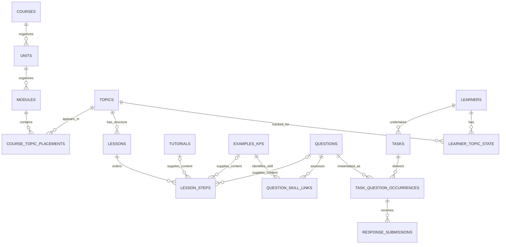

# Math Academy schema evidence and proposed Course Academy architecture

Review date: September 26, 2026. This supplements [the engine analysis](mathacademy_engine_analysis.md) with closer inspection of source HTML, normalized data, capture code, and publicly served MA client JavaScript.

The [data inventory](ma_data_inventory.md) separates populated local datasets from missing metadata and proposed schema fields.

**Recommendation**

Build one application with one relational database, a file store for captured/rendered assets, and a worker for content production. Organize the code into four responsibilities:

| Module | Responsibility | Relationship to the original four components |
| --- | --- | --- |
| Curriculum and content | Own reusable topics, instruction, questions, curriculum membership, and typed graph relationships | Combines content and graph into one coherent data domain |
| Learner model | Interpret performance, update knowledge/retention, apply FIRe-like credit, determine readiness, and calculate XP | Makes the persistent learner model an explicit part of the engine |
| Study runtime | Recommend tasks, start a selected lesson, deliver adaptive questions, administer timed assessments, and invoke learner updates | Separates deciding/delivering work from interpreting what the student learned |
| Content production | Import, recover, generate, validate, and publish content into the shared library | Preserves discovery/recovery/generation as an authoring workflow |

These are code boundaries, not a requirement for four services, servers, or databases. The original four components identify real concerns, but mix stored information with programs operating on it. Several tables represent content and graph; executable policies interpret those tables and the learner's history.

The immediate product change remains narrow: a student can choose a lesson in addition to choosing a recommendation. Both start an ordinary lesson task and use the same delivery, grading, XP, knowledge updates, reviews, and assessments. A new deadline optimizer, alternative mastery model, or separate self-study subsystem is unnecessary for that change.

PostgreSQL is a reasonable implementation choice, not an identified MA dependency. Foreign keys and relationship tables represent the graph; recursive queries can traverse dependencies. A separate graph database is not required for the proposed model. [PostgreSQL constraints](https://www.postgresql.org/docs/current/ddl-constraints.html), [recursive queries](https://www.postgresql.org/docs/current/queries-with.html).

**What we can establish about MA's schema**

We can get closer to its **logical model and client contracts** than the earlier reports did. We still do not have database DDL, ORM models, migration files, or server implementation. Browser fields, resource names, and relationships do not establish physical table names, indexes, or exact cardinalities.

Use three evidence levels:

- **Direct artifact:** an identifier, relationship, or structure appears in saved source HTML or public client code. A client function's presence does not prove its endpoint is currently used or available to a particular account.
- **Published model:** MA explains a concept such as repetition state or encompassing weights, but the internal field/storage layout is not exposed.
- **Our design:** a proposed table, constraint, module, or policy chosen to represent those facts reliably.

MA's public explanation separates the knowledge graph, student model, diagnostic algorithm, and task-selection algorithm. That supports separating learner-state interpretation from task selection. It does not prescribe service boundaries. [MA: How Our AI Works](https://mathacademy.com/how-our-ai-works).

In a developer discussion, MA describes cloning topics together with questions, knowledge points, and related records before replacing live content. This supports distinct related content records and a need to handle content changes while learners are active. It does not identify a particular revision-table implementation. [MA developer discussion, approximately 12:24–14:09](https://www.justinmath.com/math-academy-podcast-4-part-2/).

**New evidence: actual catalog relationships**

The following counts come from the current local files, not an estimate of MA's complete production database.

| Artifact | Rows | Interpretation |
| --- | ---: | --- |
| [Courses.csv][courses] | 32 | Captured course identities |
| [Units.csv][units] | 315 | Captured curriculum units |
| [Modules.csv][modules] | 1,122 | Captured curriculum modules |
| [Topics.csv][topics] | 2,971 | Distinct topic identities |
| [Catalog.csv][catalog] | 7,555 | Topic placements in course hierarchies |
| [Prerequisites.csv][prereqs] | 6,560 | Topic-to-prerequisite pairs |
| [Steps.csv][steps] | 15,652 | Captured tutorial/example placements |
| [Questions.csv][questions] | 19,646 | Captured question placements, referencing 19,644 distinct question IDs |
| [Key-Prerequisites.csv][keyprereqs] | 9,167 | Captured step-to-prerequisite-topic relationships |

There are 2,964 normalized lesson captures. Seven catalog topics therefore lack captured lesson structure; this does not show that those topics lack a lesson on MA.

**A topic belongs in a shared catalog, with course placement stored separately.** Of 2,971 topics, 2,002 appear in multiple courses, up to eight courses. Topic 773, “The Law of Total Probability,” has eight placements. A `topics.course_id` column would misrepresent this data. [Catalog example](/home/jake/Developer/MA/DATA/Catalog.csv:870).

The source TOC includes numeric unit/module IDs and topic links with course context. Hierarchical strings such as `CA2.1.2.3` are our pipeline's constructed addresses; three-character course codes are also locally assigned. They are useful display/order fields, not primary identities recovered from MA. [Source TOC](</home/jake/Developer/MA/COURSES/Math-Academy/University/Calculus-II/SOURCE-Calculus-II/TOC-Calculus-II.html:809>); [catalog construction](</home/jake/Developer/MA/PIPELINE/Math-Academy/2-Consolidate/1-Catalog/catalog.py:54>).

This supports separate course, unit, module, topic, and topic-placement records. Cross-course topic reuse is established; the current snapshot does not establish that units/modules must also be shared across courses.

**New evidence: a lesson step is not its instructional content**

Source lesson HTML contains a step ID, a step type, and a separate content ID. For topic 14:

| Step placement | Type | Content identity |
| --- | --- | --- |
| 14286 | Tutorial | 2787 |
| 14287 | Example | 4031 |

These are directly visible source attributes. The local JSON's step/item indices are derived from document order. [Source HTML](/home/jake/Developer/MA/DATA/Lessons/14/Source/14.html:1279); [normalizer](</home/jake/Developer/MA/PIPELINE/Math-Academy/3-Capture/1-Source/3-JSON/lesson-json.py:1114>).

Across the captures, 6,016 tutorial placements reference 6,014 distinct tutorial content identities; 9,636 example placements reference 9,634 distinct example identities. Reuse is small but real. Example content 13669 appears in topics 3893 and 7008 under different step IDs; its instructional sections match.

**Content IDs are typed.** Numeric content ID 2993 is a matrix tutorial in topic 1196 and a similarity-transformations example in topic 491. Across the snapshot, 3,022 numeric IDs occur in both the tutorial and example namespaces. A single untyped `content_id` key would merge unrelated records. Use separate tutorial/example identities or a source key containing the content type. [Tutorial 2993](/home/jake/Developer/MA/DATA/Lessons/1196/Source/1196.html:1243); [example 2993](/home/jake/Developer/MA/DATA/Lessons/491/Source/491.html:1571).

A unified ordered lesson-step table can reference a tutorial, example, or question. It must retain actual order. Sorting by IDs does not recover teaching order. The captured lessons also contain multiple tutorials: only 1,263 of 2,964 have exactly one, while the others have two through ten. A model restricted to one introduction followed by examples would be narrower than the captured MA material.

**Knowledge point, example, and step need careful mapping**

There is now a verified cross-artifact join. Completed diagnostic questions 53708 and 53707 link to `/topics/491#2993`. The reference lesson identifies the corresponding example as content 2993 at step 9670. In this case, the KP fragment identifies **example content**, not the lesson-step ID. [Activity observation](/home/jake/Developer/study/vault/252/mathacademy-activity-schema.md:282); [matching source](/home/jake/Developer/MA/DATA/Lessons/491/Source/491.html:1571).

The public reference-page client also navigates from a question's associated example to the matching lesson step, and consumes a lesson object containing a task identifier and ordered steps. This supports keeping example/KP identity separate from placement. Its reference context can submit answers; that alone does not establish normal lesson XP or mastery credit. [Public reference client](https://mathacademy.com/js/student-reference.js).

The closest model is therefore a KP/example record with associated questions, placed within lesson structure. A separate semantic `knowledge_points` table is possible, but it should not invent a second unrelated identity for every example without a reason. Preserve explicit source mappings, with confidence and context, as more cases are verified.

The captured key-prerequisite data is indexed by lesson step. Reused example content can have different captured prerequisites in different placements. Those captures may reflect context, version differences, or incomplete observation. Preserve each source assertion with its placement/snapshot; do not silently resolve discrepancies into a universal example-level dependency. [Step prerequisite export][keyprereqs].

**New evidence: public client vocabulary extends the captures**

The public API wrapper distinguishes topics, lessons, typed steps, examples, question groups, tests, and tasks. It links questions to examples/groups and exposes course-specific optionality and multistep skill targets. It contains old/new code and inconsistent signatures, so it establishes client vocabulary rather than a verified server contract. [Public API wrapper](https://mathacademy.com/js/api.js).

This supports distinct lesson and test resources; their production cardinalities remain unknown. The earlier reference captures exposed only topic identity and nested lesson content. Our proposed tables retain the additional distinctions.

The current question client selects six formats: multiple choice, free response, static select, dynamic select, proof, and code. It reads a learner-answer object, explanation, task response, and optional speed-bonus fields. Submission distinguishes lesson, review, diagnostic, and reference contexts. These observations extend the earlier three-format capture summary; they do not establish which formats every course uses. [Public question client](https://mathacademy.com/js/question-widget.js).

Static-select code consumes correctness per input. Dynamic-select code supports several submissions before a final answer, changing question segments, and a partial-credit display. These capabilities were not exposed by the sampled completed-history pages. Our response model should allow multiple submissions and optional per-part results, without inventing either in old imports. [Static-select client](https://mathacademy.com/js/static-select-question-widget.js), [dynamic-select client](https://mathacademy.com/js/dynamic-select-question-widget.js).

A public task-event client buffers interaction events containing task/source identity, event kind, client timestamp, and retry information. Browser persistence exists for that buffer. This supports an interaction-log concept; it does not prove MA uses event sourcing for its learner model. [Event client](https://mathacademy.com/js/task-event.js), [browser event storage](https://mathacademy.com/js/task-event-storage.js).

Student/class priority-topic operations also appear in the wrapper. Ordinary learner access and current behavior remain unverified. Their presence alone does not satisfy the requested lesson picker. [Public API wrapper](https://mathacademy.com/js/api.js).

**Question identity, placement, presentation, submission, and result are separate**

Question 56649 appears in topics 3893 and 7008 with the same prompt, graphic, and answer values, but different letter assignments. Question 156726 is similarly reused. Therefore:

```text
Reusable question
  → placement in a lesson or question bank
  → particular presentation delivered to a learner
  → one or more submitted responses
  → final result and associated evidence
```

The same question ID and letter can refer to different answer content across presentations. A DOM ID incorporating the question number and letter identifies a displayed position, not a permanent answer-option identity. Preserve the presented option order, or map each displayed position to a stable local option ID. [One captured presentation](/home/jake/Developer/MA/DATA/Lessons/3893/Source/3893.html:2013); [another presentation](/home/jake/Developer/MA/DATA/Lessons/7008/Source/7008.html:1224).

The question CSV's association with the preceding example step is calculated from document order. Its answer-cardinality field counts response positions, not correct multiple-choice options. Its 19,646 rows are lesson samples, not MA's full assessment bank. [Question export implementation](</home/jake/Developer/MA/PIPELINE/Math-Academy/3-Capture/2-Lesson-Data/3-Questions/questions.py:131>).

The existing completed-activity inspection supports a task ID plus an ordered question occurrence. It does not consistently expose submitted values, original choices, unique submission IDs, or per-part results. The reduced 34-task XP dataset does not retain question IDs at all. There are no full completed-page captures in the searched artifact trees to substitute for those missing fields. [Activity schema][activity]; [reduced observations](</home/jake/Developer/study/vault/252/mathacademy-xp-observations.json:11>).

**Proposed tables: curriculum and reusable content**

All table/column names below are recommendations, not recovered MA DDL. `id` denotes a local primary key; source identifiers are preserved separately. Revision references can be separate rows or a consistent revision scheme, but delivered content must remain identifiable after edits.

| Table | Main fields and foreign keys | Evidence / purpose |
| --- | --- | --- |
| `courses` | `id`, source identity, title | Captured course records |
| `units` | `id`, `course_id`, position, title | Ordered course organization; allow placement tables later if reuse is established |
| `modules` | `id`, `unit_id`, position, title | Ordered unit organization |
| `topics` | `id`, source identity, title, skill scope, publication status | Reusable skill identity across courses |
| `course_topic_placements` | `id`, `module_id`, `topic_id`, position, course-specific attributes | Represents many-course membership; derive course through module/unit |
| `lessons` | `id`, `topic_id`, revision, publication status | Instructional structure for a topic; our versioning policy should choose the active revision explicitly |
| `tutorials` | `id`, typed source identity, revision, title, body | Reusable instructional content |
| `examples` | `id`, typed source identity, revision, title, problem, explanation; verified KP mapping | Reusable worked-example/KP content |
| `lesson_steps` | `id`, `lesson_id`, position, kind, one tutorial/example/question reference, optional context example reference, placement title | The ordered appearance of content in a lesson |
| `questions` | `id`, source identity, revision, format, prompt/body, explanation, response specification, grading specification/status | Reusable assessable item; source outcome data does not supply a missing grading key |
| `question_skill_links` | `question_id`, example/KP reference, role, provenance | Separates what a question assesses/practices from where it appears; preserves uncertain mappings |
| `question_groups` | `id`, source identity when known, configuration | An additional client resource; do not assume it equals a lesson KP group or a parameter generator |
| `question_group_memberships` | `group_id`, `question_id`, position when supported | Our normalized representation of question grouping; exact production cardinality remains unknown |
| `assets` | `id`, content hash, location, media type, source/revision references | Figures, diagrams, and preserved rich-content dependencies |

`lesson_steps` should use typed references with an exactly-one-content constraint. An untyped `(kind, content_id)` convention is acceptable for raw import, but canonical rows should enforce referential integrity. A question's lesson placement and its skill links need not be the same relationship.

Answer slots, choices, and rich body segments can begin as structured JSON on a question revision. Give them separate tables when independently querying/updating them provides a benefit. Their ordering and identities still need a clear contract. Normalizing every fragment of prose, equation, or diagram into a separate row is unnecessary.

Do not make every reusable example belong exclusively to a single topic: the captures establish reuse. If a local semantic KP needs a distinct scope from a shared worked example, introduce an explicit KP identity and mapping instead of forcing the example record to mean both things inconsistently.

**Proposed tables: graph relationships**

Use dedicated relationship tables for the few known semantic types. This makes endpoints, constraints, and traversal direction clear.

| Table | Main fields | Meaning |
| --- | --- | --- |
| `topic_prerequisites` | dependent topic, required topic, graph revision, provenance | Readiness requirement |
| `key_prerequisites` | example/KP reference, required topic, optional lesson-step context, graph revision, provenance | Skill especially relevant to a particular point of struggle |
| `topic_encompassings` | advanced topic, component topic, weight, graph revision, provenance/validation | Fractional implicit practice; can cross prerequisite ancestry |

These are conceptually different. The current exports contain direct and step-specific prerequisites; they contain no encompassing weights. The book supports weighted encompassing relationships, but a working reproduction must obtain or estimate those weights separately. It cannot recover them by renaming prerequisite rows. [FIRe chapter][fire].

The current global prerequisite CSV is an additive consolidation of several sources. Four required-topic IDs are outside the topic catalog: 5555, 6050, 6737, and 6747. Preserve unresolved source references in staging until resolved; do not silently drop them or claim the canonical graph is complete. The table should not accept a broken foreign key merely because a CSV contained one.

A generic graph view can union these relationships for visualization. The runtime should still distinguish readiness from practice coverage and targeted remediation. Confidence in an estimated edge and the edge's practice weight are different attributes. Postrequisites, ancestry, and the knowledge frontier are derived queries or caches, not additional authoritative copies of the same relationships.

**Proposed tables: what the learner did**

| Table | Main fields and keys | Why it is separate |
| --- | --- | --- |
| `learners` | `id`, account settings | Identity and preferences |
| `enrollments` | learner, course, active interval, source/provenance | Curriculum context differs from topic identity |
| `tasks` | `id`, learner, type, source task ID, topic/resource references, status, timestamps/provenance, selection origin, XP award/baseline | One concrete activity, including each distinct retake |
| `task_question_occurrences` | `id`, `task_id`, position, question revision, KP/group context, exact presentation/choice order, final outcome | Identifies what was delivered, independently of reusable content |
| `response_submissions` | occurrence, submission sequence, response, time/provenance, grading result, optional per-part results, grader version | Supports multiple attempts within one interactive question |
| `task_kp_groups` | task, group position, observed title, verified KP mapping when available, terminal outcome when known | Preserves lesson grouping and focused failure history |
| `task_events` | task, event kind, source, event time/provenance, payload, local deduplication key | Interaction and lifecycle evidence; separate from a graded response |

The observed task family values remain Lesson, Review, Assessment, Multistep, Diagnostic, and Supplemental Diagnostic. Public code exposes additional execution contexts; these should not be silently inserted into the historical export as if observed there.

One base `tasks` table avoids duplicating learner, status, XP, and timing fields in six separate attempt tables. A `tests` detail record can hold a source test identity, timing/configuration, and its task relationship. Multistep definitions and ordered steps can hold reusable scenario structure and skill targets. Those detail records serve distinct data needs without replacing the shared task history.

Our task record may include `selection_origin = recommended | learner`. This is bookkeeping for the new capability, not an input that changes the meaning of a correct answer. Source retake relationships, outcomes, start times, or submission records must remain unknown where they were not observed.

For imported MA results, preserve the observed final result even when a submission or answer key is missing. Do not manufacture a `response_submissions` row containing an invented response. Local delivery can provide complete submission records and exact content/grade references going forward.

**Proposed tables: what the engine currently believes**

| Table | Main fields | Status of the evidence |
| --- | --- | --- |
| `learner_topic_state` | learner/topic key; diagnostic balance; conditional credit; baseline-readiness status; recent accuracy; learning speed; repetition progress; memory value/reference time; last practice; model/graph version | The concepts are published; these particular columns and values are not exported from MA |
| `learner_kp_state` | learner/KP key; focused performance/failure summaries | Optional cache; can initially be derived from task/question history |
| `model_versions` | policy version, chosen parameters, code/configuration reference | Our reproducibility mechanism for uncertain FIRe and scheduler rules |
| `scheduler_decisions` | learner/time; state/graph version; eligible/offered candidates; selected task; selection reasons | Our observation/debugging record, not a recovered MA table |

The separation between history and current state matters. A response is an observed fact; mastery and retention are estimates derived from evidence under a particular model. The state can change as time passes, after another topic is practiced, or when an inference is corrected. A row stating that a lesson was completed cannot replace the learner-topic model. [FIRe chapter][fire]; [activity-schema limitations][activity].

Initially, store a task's signed XP award and displayed baseline on `tasks`. A separate `xp_ledger` is useful if we add independent adjustments, bonuses, or accounting requirements; it is not required by the current completed-task evidence. Likewise, frontier/due-review sets can be computed or cached. They need not become separate authoritative learning histories.

A local update should have an idempotency key and an explicit transaction boundary so retries cannot award XP or repetition credit twice. Preserve the event and the corresponding state/award changes consistently. These are our correctness requirements, not assertions about MA's persistence mechanism.

**Proposed tables: production and provenance**

| Table | Purpose |
| --- | --- |
| `source_snapshots` | Preserve original artifact location/hash, capture time, extraction version, and coverage |
| `source_mappings` | Map typed external identities to local records without assuming numbers are globally unique |
| `source_assertions` | Retain conflicting or uncertain relationship/field observations with context |
| `production_jobs` | Track an import, answer-recovery, or generation request and its outputs/failures |
| `question_generators` | Register a Python generator/version, valid parameters, skill scope, and checks |
| `generated_instances` | Record generator version/seed/parameters and the resulting immutable question revision |

These are our content operations. Imported, recovered, and generated questions should enter the same validated question library. Their origins differ; a separate learning engine for each origin would fragment knowledge updates and review coverage.

The source material states that MA handcrafts content and graph metadata. That does not establish a programmatic question-template schema. Our Python/LLM supply is an extension needed for the available-content gap, and its tables should be labeled accordingly. [MA graph/content authoring account](https://www.justinmath.com/how-math-academy-creates-its-knowledge-graph/).

**How the tables fit together**

The diagram shows our proposed logical relationships. It omits asset/provenance/detail records for readability and uses `EXAMPLES_KPS` for the verified example/KP mapping rather than asserting a recovered table name.



Graph relationships connect the topic/KP records above. They can be stored as ordinary database rows while the engine loads adjacency structures for efficient calculations. The database is the durable store; the graph is a way of interpreting and querying part of its data.

**The minimal behavioral change: two entry points, one learning path**

```text
Recommended lesson ─┐
                   ├→ start ordinary lesson task
Student selection ─┘
                      → deliver and grade questions
                      → record responses and task progress
                      → update the same learner model
                      → finalize the same XP policy
                      → recompute ordinary review/test/task eligibility
```

The important distinction is between **eligible** and **recommended**. A ready lesson may be eligible without appearing in the current recommended menu. The picker exposes that additional choice. Prerequisite readiness can be shown to the learner, and a preview or attempted lesson must not fabricate mastery of untested prerequisites.

The runtime should update state at the appropriate response/task boundaries; it should not wait for a successful completion to record all failures. Completion finalizes the task under the same rules regardless of how it was selected. Any missing review/test items trigger a production request for the ordinary content library.

Opening MA's reference page is not evidence of completing a normal lesson: the public client treats it as a distinct submission context. Our implementation must launch the ordinary lesson pathway if it is to produce ordinary lesson credit. The existence of reference practice therefore does not by itself satisfy Jake's requested behavior.

**What this changes from the earlier proposal**

- Content and graph can share one curriculum domain and database. They require distinct relationship semantics, not necessarily distinct systems.
- The learner model deserves its own explicit code boundary and state tables. It is the missing link between a question result and later reviews/tests.
- A lesson has ordered placements of reusable content. Step identity, example/KP identity, and question identity should not be collapsed.
- Task history, question presentations, submissions, and current knowledge estimates should be separate. Public interactive-question code makes this distinction more concrete than the completed-page samples alone did.
- Content production publishes into the library; it does not directly declare learner mastery.
- A manual lesson selection adds an entry point and optional origin field. It does not require replacing the scheduler, timed assessments, remediation, or retention model.

The closest defensible reproduction is a logical model preserving the identities and relationships the evidence exposes, with explicitly chosen implementations for the hidden learner-state and scheduling functions. Copying our existing CSV headers verbatim into tables would lose too much of that structure.

**Evidence collection and limits**

Local catalog/lesson files and producing code were inspected read-only. Counts and identifier/cardinality checks were computed directly from those files. Public JavaScript was fetched without cookies or account access; the scripts were read, not executed. No application API endpoints, live learner tasks, or administrative actions were invoked.

Client scripts are mutable and can contain legacy code. The API wrapper includes old/new sections, and some caller arguments do not match wrapper parameter names. Do not use these findings as an authenticated API integration specification without additional legitimate observation. The exact production database engine/schema, field types, hidden state values, encompassing weights, and FIRe functions remain unknown.

Selected SHA-256 hashes of public assets inspected in this review:

```text
api.js
8bc5629e5069e0e2503a0cd7eedbbeff35520f6351a23617546831c700774f1d
student-reference.js
e86444a40a8fa8f683a99e31c65a1fd23df2ee406aae7e4ab8254a7071418d52
question-widget.js
5aa7c51c3947adb41e480071e54fbd4429046c1f903105bc9aa530a4c51164d9
task-event.js
b3962af930f132c57b9882558a10ae2b0d04c04136fc351481f363cb914e90d1
```

[courses]: /home/jake/Developer/MA/DATA/Courses.csv
[units]: /home/jake/Developer/MA/DATA/Units.csv
[modules]: /home/jake/Developer/MA/DATA/Modules.csv
[topics]: /home/jake/Developer/MA/DATA/Topics.csv
[catalog]: /home/jake/Developer/MA/DATA/Catalog.csv
[prereqs]: /home/jake/Developer/MA/DATA/Prerequisites.csv
[steps]: /home/jake/Developer/MA/DATA/Lesson-Data/Steps.csv
[questions]: /home/jake/Developer/MA/DATA/Lesson-Data/Questions.csv
[keyprereqs]: /home/jake/Developer/MA/DATA/Lesson-Data/Key-Prerequisites.csv
[activity]: /home/jake/Developer/study/vault/252/mathacademy-activity-schema.md
[fire]: </home/jake/Developer/MA/DATA/The Math Academy Way/V-TECHNICAL-DEEP-DIVES/29-Technical-Deep-Dive-on-Spaced-Repetition/29-Technical-Deep-Dive-on-Spaced-Repetition.md>
