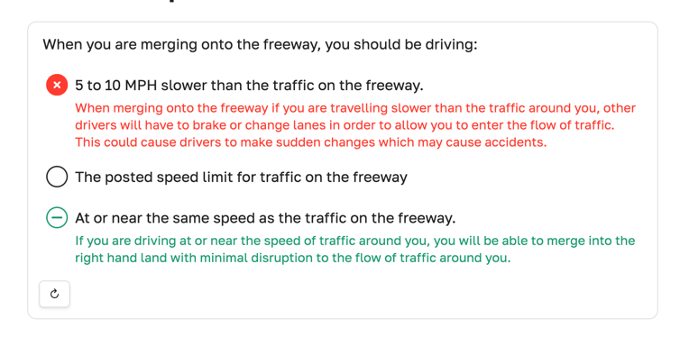
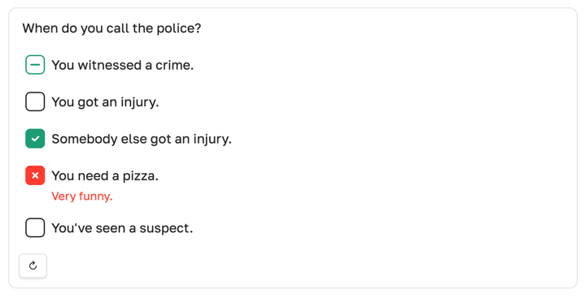
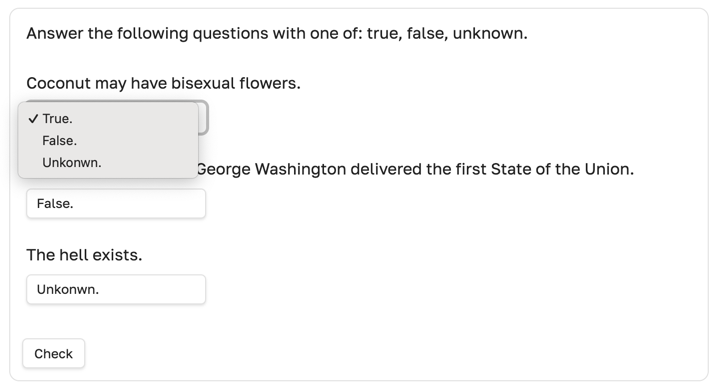
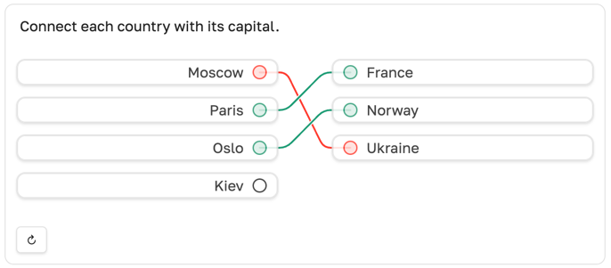
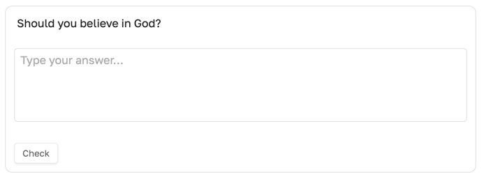

# Quiz blocks [](https://obsidian.md/plugins?id=quiz-blocks)

Render ` ```quiz ` code blocks into interactive quizzes directly inside Obsidian notes.


## How it works

You basically describe a quiz with a YAML code block.
The plugin transforms it into a nice interactive form.
Depending on the quiz type, you can select options, connect pairs, write free responses, or fill blanks.
There is a **Check** button that grades or reveals answers,
with optional `feedback` commentary. Great for self-education and learning notes.


## Supported quiz types

### `radio` — single correct option



<details><summary>show code</summary>

````yaml
```quiz
type: radio
content: >-
    When you are merging onto the freeway, you should be driving:

options:
- content: 5 to 10 MPH slower than the traffic on the freeway.
  feedback: When merging onto the freeway if you are travelling slower than the traffic around you, other drivers will have to brake or change lanes in order to allow you to enter the flow of traffic. This could cause drivers to make sudden changes which may cause accidents.

- content: The posted speed limit for traffic on the freeway
  feedback: The posted limit for any roadway is a limit and may not be a safe speed for traffic under current conditions. When merging into traffic, the most important thing is to be travelling at approximately the same speed as those around you so that you can join the flow of traffic with the least disruption.

- content: At or near the same speed as the traffic on the freeway.
  feedback: If you are driving at or near the speed of traffic around you, you will be able to merge into the right hand land with minimal disruption to the flow of traffic around you.
  correct: true
```
````

</details>

### `checkbox` — multiple correct options



<details><summary>show code</summary>

````yaml
```quiz
type: checkbox
content: >-
  When do you call the police?

options:
- content: You witnessed a crime.
  correct: true
- content: You got an injury.
- content: Somebody else got an injury.
  correct: true
- content: You need a pizza.
  feedback: Very funny.
- content: You've seen a suspect.
```
````

</details>

### `select` — multiple dropdown questions sharing the same options



<details><summary>show code</summary>

````yaml
```quiz
type: select
content: >-
  Select the capital city for each country.

options:
- id: paris
  content: Paris
- id: ottawa
  content: Ottawa
- id: lisbon
  content: Lisbon

questions:
- content: France
  correct_option: paris
- content: Canada
  correct_option: ottawa
- content: Portugal
  correct_option: lisbon
```
````

</details>

### `multi-select` — multiple dropdown questions with separate options

<details><summary>show code</summary>

````yaml
```quiz
type: multi-select
content: >-
  Choose the correct answer in each dropdown.

questions:
- content: Select 1
  options:
  - id: pi
    content: '$\pi$'
  - id: minus-one
    content: '$-1$'
  - id: zero
    content: '$0$'
  - id: one
    content: '$1$'
  correct_option: pi

- content: Select 2
  options:
  - id: not-orthogonal
    content: are not orthogonal
  - id: orthogonal
    content: are orthogonal
  correct_option: orthogonal
```
````

</details>

### `noodle` — multiple questions connected with options



<details><summary>show code</summary>

````yaml
```quiz
type: noodle
content: >-
  Connect each country with its capital.

options:
- id: paris
  content: Paris
- id: oslo
  content: Oslo
- id: kyiv
  content: Kyiv

questions:
- content: France
  correct_option: paris

- content: Norway
  correct_option: oslo

- content: Ukraine
  correct_option: kyiv
```
````

</details>

### `free` — free text without forced validation



<details><summary>show code</summary>

````yaml
```quiz
type: free
content: >-
    Should you believe in God?

# optional reference answer shown after pressing [Check]
correct: >-
    Well, there is no the right answer here, as it's all personal.
```
````

</details>

### `blank` — fill in the ==gaps==


<details><summary>show code</summary>

````yaml
```quiz
type: blank
content: |-
	The chemical symbol for water is ==H²O==.

	It freezes at ==0°C== under standard atmospheric pressure.

# optional feedback shown after pressing [check]
feedback: >-
  Use ==double equals== to hide text until you reveal the answer.
```
````

</details>

By default, `blank` requires an exact text match. Set `require_exact: false` when typed answers should not be graded exactly. This is useful for math or LaTeX answers where the learner's input may be equivalent but not text-identical; pressing **Check** reveals the expected answer beside each blank in the correct-answer color while keeping the input box neutral.

````yaml
```quiz
type: blank
require_exact: false
content: |-
  The derivative of $x^2$ is ==$2x$==.
```
````

Hidden answers are rendered as markdown after checking, so inline math can be written as `==$2x$==`.

## Installation

**Quiz Blocks** is currently waiting for approval to appear in the official Obsidian Community Plugins list.
Until then, it can be installed and automatically updated using **BRAT** or manually.

#### Install using BRAT (beta-channel)

<details><summary>show steps</summary>

1. Install the **BRAT** plugin:
	* Using the link: https://obsidian.md/plugins?id=obsidian42-brat
      * Click **Install**, then **Enable**
    * Manually:
      * Open **Settings → Community plugins → Browse**
      * Search for **BRAT**
      * Click **Install**, then **Enable**
2. Open **Settings → BRAT**.
3. Click **Add Beta plugin**.
4. Paste this repository URL:
   ```
   https://github.com/xamgore/obsidian-quiz-blocks
   ```
5. Click **Add plugin**.
6. Go to **Settings → Community plugins** and enable **Quiz Blocks**.

</details>

#### ~~Install by link~~

<details><summary>show steps</summary>

1. Click https://obsidian.md/plugins?id=quiz-blocks
2. Click **Install**, then **Enable**.
</details>

#### ~~Install from Obsidian Community Plugins~~

<details><summary>show steps</summary>

1. Open **Obsidian**.
2. Go to **Settings → Community plugins**.
3. Make sure **Safe mode** is disabled.
4. Click **Browse**, search for **Quiz Blocks**.
5. Click **Install**, then **Enable**.
</details>

#### Install manually (from GitHub)

<details><summary>show steps</summary>

1. Download `obsidian-quiz-blocks.zip` from the
   [GitHub releases page](https://github.com/xamgore/obsidian-quiz-blocks/releases).
2. Extract the downloaded ZIP file.
3. Copy the extracted folder into your vault’s plugin directory:
   `YOUR_VAULT/.obsidian/plugins/`
4. Restart Obsidian or go to **Settings → Community plugins** and click **Reload plugins**.
5. Enable **Quiz Blocks** from the list.
</details>


## Options reference

Valid quiz types are `radio`, `checkbox`, `select`, `multi-select`, `noodle`, `free`, and `blank`.
Older names such as `choice`, `text`, and `prompt` are not accepted.

### Shared fields

| Field | Applies to | Description |
| --- | --- | --- |
| `type` | all quiz blocks | Required. One of `radio`, `checkbox`, `select`, `multi-select`, `noodle`, `free`, or `blank`. |
| `content` | all quiz blocks | Optional prompt text. Markdown is supported. |
| `id` | all quiz blocks | Optional stable identifier. |
| `gated` | all quiz blocks | Optional boolean. Default `false`. When `true`, the quiz can conceal surrounding preview content until the quiz is started or completed. |
| `shuffle` | quizzes with `options` | Optional boolean. Default `false`. Shuffles the `options` list for `radio`, `checkbox`, `select`, and `noodle`; for `multi-select`, shuffles each question's `options` list. |

### Option fields

`radio` and `checkbox` use an `options` list.

| Field | Description |
| --- | --- |
| `content` | Required option label. Markdown is supported. |
| `correct` | Optional boolean. Default `false`. Marks the option as a correct answer. |
| `feedback` | Optional explanation shown after pressing **Check** when the option is selected or correct. |
| `id` | Optional stable option identifier. If omitted, the option content is used. |

### Pairing fields

`select` and `noodle` share one `options` list across several `questions`.
For `select`, dropdown labels render inline Markdown, including inline math.

| Field | Location | Description |
| --- | --- | --- |
| `options[].id` | `options` | Recommended stable answer identifier. If omitted, option content is used. |
| `options[].content` | `options` | Required answer label. Markdown is supported. |
| `questions[].content` | `questions` | Required question label. Markdown is supported. |
| `questions[].correct_option` | `questions` | Required. Must match an option `id`. |
| `questions[].feedback` | `questions` | Optional explanation shown after pressing **Check**. |

### Multi-select fields

`multi-select` defines a separate `options` list for each dropdown question.
Dropdown labels render inline Markdown, including inline math.

| Field | Location | Description |
| --- | --- | --- |
| `questions[].content` | `questions` | Required question label. Markdown is supported. |
| `questions[].options[].id` | `questions[].options` | Recommended stable answer identifier. If omitted, option content is used. |
| `questions[].options[].content` | `questions[].options` | Required answer label. Markdown is supported. |
| `questions[].correct_option` | `questions` | Required. Must match an option `id` in the same question's `options` list. |
| `questions[].feedback` | `questions` | Optional explanation shown after pressing **Check**. |

### Free response fields

`free` is not auto-graded. It freezes the typed response after **Check** and can show a reference answer.

| Field | Description |
| --- | --- |
| `correct` | Optional reference answer shown after pressing **Check**. |
| `feedback` | Optional explanation shown after pressing **Check**. |

### Blank fields

`blank` turns text wrapped in `==double equals==` inside `content` into input blanks.

| Field | Description |
| --- | --- |
| `require_exact` | Optional boolean. Default `true`. When `true`, typed answers are exact-match graded. When `false`, answers are revealed without marking the input box right or wrong. |
| `feedback` | Optional explanation shown after pressing **Check**. |


## Notes & limitations

This is an early-stage plugin, bugs are possible. Feel free to [open an issue](https://github.com/xamgore/obsidian-quiz-blocks/issues/new/choose) and share feedback.

To access an interactive quiz in the preview mode, you have to write some YAML code
in the source mode. Errors related to missing fields can still be cumbersome 
(vote [#4](https://github.com/xamgore/obsidian-quiz-blocks/issues/4)).

- Answers are ephemeral, kept until the tab is closed. If you have a good reason to keep them longer, vote [#2](https://github.com/xamgore/obsidian-quiz-blocks/issues/2).
- Instant feedback without pressing **Check** is not implemented yet.
- More quiz types planned: `cards`.


## Motivation

These are just a few examples of recurring requests and discussions in the Obsidian community around lightweight quiz functionality.

> [@amcasas:](https://forum.obsidian.md/t/quiz-type-plugin/2237) need some type of quiz function that you can add at the end of each note

> [@deleted:](https://www.reddit.com/r/ObsidianMD/comments/1ns1g7z/making_mcq_questions_in_obsidian/)
> in such a way that a maximum of one option is choosable for each question.

> [@30DayThrill:](https://www.reddit.com/r/ObsidianMD/comments/17lcsvf/quizzing_plugin_strategies_for_obsidian/)
> looking for a quizlet-esque solution where I can create more multiple choice or question and answer style tests.

If you find this plugin useful, please consider telling others about it or starring the repository&nbsp;⭐️

<br>
<br>
