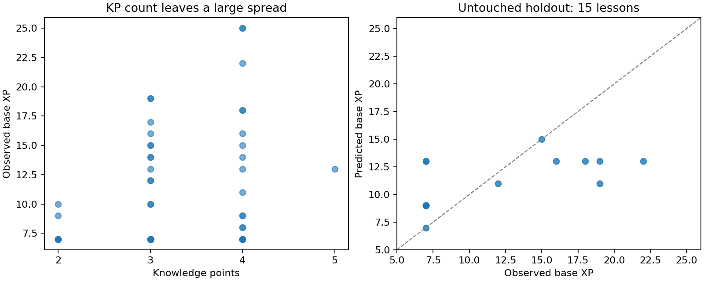

# A cheap estimate of Math Academy base XP

Analysis date: October 4, 2026. This study estimates **base XP**, the displayed task denominator. It does not estimate earned XP, bonuses, or mastery. It uses saved content and observations, without contacting Math Academy or changing the database or learner state.

The best small model improved prediction of unseen lessons, but its error is still several XP. Reuse observed bases for existing topics. For new content, the formula below is a practical first estimate of workload, with room for later calibration.

## What the evidence says

Math Academy describes lesson XP as expected workload derived from knowledge points, tutorials, expected question counts, and question-time estimates initially supplied by content writers and subsequently calibrated with student data. Its public reference is an average serious student at the appropriate level, rather than an exceptionally fast learner or a particular student's stopwatch. [Skycak's explanation](https://www.justinmath.com/golden-nuggets-podcast-39/), [Math Academy FAQ](https://mathacademy.com/faq), [description of the reference learner](https://www.justinmath.com/record-for-most-work-done-on-math-academy-on-a-single-date-as-of-july-2024/).

The structural interpretation is:

```text
base XP ≈ instructional minutes
          + sum over KPs (expected question count × expected minutes per question)
```

The captures do not expose those expected question times or normal expected counts. The bot usually deliberately answers five questions per KP. Those five are the extraction policy, not evidence that Math Academy prices every lesson as five questions per KP. Averaging features within each KP avoids charging for the size of the extracted pool.

The frozen dataset contains 58 completed lessons with complete KP/example/question structures, 40 reviews with known bases, four quizzes, and three completed multisteps. One additional review lacks a recoverable denominator in its state; one multistep was incomplete at extraction. The historical CSV adds 135 lesson and 53 review observations, but most lack the captured content needed for regression. Capture records were frozen at **2026-10-04 21:16:25 UTC**; the live script continued independently.

| Observation | What it supports |
|---|---|
| Three-KP lessons range from 7 to 19 XP; four-KP lessons from 7 to 25 | Work per KP matters substantially; KP count alone is inadequate |
| 28 of 58 captured lessons have base 7; all 135 historical lesson rows have base at least 7 | A seven-XP floor is useful for this content sample |
| Worked-solution mathematical length predicts better than counts alone | Computational workload is a useful cheap proxy for expected question time |
| Tutorial count did not improve out-of-topic predictions | Counting slides without measuring their content loses too much information |
| E/M/H shares performed worse than solution length | Difficulty labels are insufficient as universal duration weights |
| 16 of 17 topics overlapping old history have exactly the same base | Preserve observed topic bases; regenerate estimates mainly for new or changed content |

These are associations, not isolated causal effects. Tutorial count failing to improve this small regression does **not** mean tutorial time is absent from MA's calculation. For example, several tutorial slides may present a short conceptual explanation, while one slide may contain a long derivation.

The exception in the historical overlap is Finding Points on Transformed Curves: old base 13 in June 2025, captured base 10 in October 2026. Content changes or recalibration are plausible; the data do not identify the cause. Observed values therefore retain provenance and are not treated as immutable topic constants.

## The provisional lesson formula

After choosing the model family on training topics, refitting that family on all 58 lessons gives:

```text
B = max(7, floor(3.16 + 0.64 K + 0.0159 Q + 0.0005 R + 0.5))
```

- **K**: number of knowledge points.
- **Q**: for each KP, average the number of mathematical tokens in its questions' worked solutions; then sum those KP averages.
- **R**: total prose words in tutorials and canonical examples, including example solutions. Formulas, script/style content, widget headers, and image paths are excluded.

A mathematical token here is a LaTeX command, number, individual letter, or arithmetic/equality/script operator inside a Markdown math expression. This is a fixed cheap tokenizer, not an LLM tokenizer or a semantic count of operations. Its implementation is in [estimator.py](estimator.py).

For example, K=3, Q=400, R=500 gives 11.69 expected minutes, rounded to **12 base XP**. Doubling the number of equivalent questions stored in each KP's pool leaves its average Q unchanged.

The coefficients are predictive weights, not recovered reading speeds or independently identified timing components. In particular, the small prose coefficient does not mean people read at that literal rate. These features overlap, and there are no controlled examples that isolate the time of reading from the time of understanding or computation.

The seven-XP floor is empirical for the observed lesson population. Do not carry it into individual question prices, arbitrary short activities, reviews, or other curricula without checking their scale. There is no 25-XP cap.

## Validation

Thirteen small candidate families were specified before fitting. They included KP count, tutorial count, difficulty shares, worked-example steps, question-solution steps/length, prompt length, extra answer fields, and blank-answer frequency. Fits use nonnegative linear coefficients so adding measured workload cannot lower the estimate.

The first 43 topics by task ID were used for model selection with leave-one-topic-out validation. The remaining 15 topics were held out until the family was selected. Task-ID ordering approximates issuance order; it is not a claim about exact completion chronology. All 58 lesson topics are distinct, and the implementation also groups repeated topics should they appear later.

| Model | Training topic CV mean absolute error | Held-out mean absolute error |
|---|---:|---:|
| Constant training median | 3.86 XP | 4.87 XP |
| KP count | 3.49 XP | 4.87 XP |
| KP count + tutorial count | 3.60 XP | 4.87 XP |
| KP count + E/M/H proportions | 3.60 XP | 4.53 XP |
| KP count + question-solution equals signs | 2.81 XP | Not used to select on the holdout |
| **KP count + solution math length + instructional prose** | **2.49 XP** | **3.60 XP** |

The selected family reduced held-out average error by **26%** compared with KP count. On the 15 held-out lessons, 8 were within 2 XP, 9 within 3 XP, and the worst error was 9 XP. Only two predictions matched exactly.

Leave-one-topic-out evaluation of the selected family across all 58 topics gives mean absolute error **2.83 XP**, with 42/58 predictions within 3 XP. This is a supplementary check, not a second untouched holdout: those data have already informed family selection. The worst error is 14 XP. The displayed formula uses rounded coefficients from the all-data refit; the untouched holdout score used coefficients fitted only to the original 43 topics.

The large misses matter. The initial holdout model priced Differentiating Reciprocal Trigonometric Functions at 13 instead of 22, and Integrating Trigonometric Functions at 13 instead of 7. In all-topic validation, Vertical Asymptotes of Rational Functions was estimated at 11 instead of 25. Text length misses short but demanding reasoning and can overprice lengthy explanations of routine work. Graph/image content also lacks a semantic workload measure.



## Other activity types and a practical policy

Use the simplest source of a usable baseline, in this order:

1. **Existing imported content:** use the latest observed base for the same activity type and topic, retaining provenance. [observed-bases.json](observed-bases.json) contains observations for **163 lesson topics and 70 review topics**, with older differing values preserved.
2. **New lessons:** precompute K, Q, and R when content is saved; use the provisional formula. Changing an activity's instructional scope requires recomputing its features. A topic's full-lesson base should not automatically price a shortened lesson.
3. **Reviews:** 4 XP is a strong provisional default for this population. It matches 31/40 captured reviews, with mean absolute error 0.35 XP; historical review bases range from 4 to 7. This is descriptive baseline performance, not held-out validation of a learned review model. Preserve observed 5/6/7-XP review bases where available. These samples do not identify a reliable general review workload formula.
4. **Timed quizzes:** all four captured quiz bases exactly equal their stated limits: 14, 15, 12, and 15 minutes. For a quiz deliberately assembled to match a time budget, that budget is a good cheap base. Setting a generous limit on an arbitrary question set does not establish its expected workload.
5. **Multisteps:** the three complete captures all contain eight question parts but have bases 7, 9, and 12. Count alone is inadequate, and three examples do not support fitting a separate content model. Preserve known bases or use independently estimated time for the selected parts.

Base XP should remain separate from a learner's actual pace and from earned XP. The existing [award analysis](../mathacademy-xp-analysis.md) concerns the performance adjustment after the base is assigned; it does not supply a model for that base.

## Cost, reproducibility, and next useful data

The numeric estimator uses the standard library, four coefficients, and no network/model/database calls. A local benchmark of 200,000 calls measured about **0.94 microseconds per estimate**. A short worked-solution token count took about 5.3 microseconds. These are machine-specific measurements. Feature extraction is linear in content size and can be cached at content import.

The capture script and database were not modified. The estimator is an analysis prototype, not integrated into award or scheduling behavior.

Reproduce from the frozen data:

```sh
/home/jake/Developer/MA/.venv/bin/python reference/mathacademy-base-xp/analyze.py
```

Use `--refresh` only to deliberately replace the frozen observations with the current captures. [observations.json](observations.json) retains base evidence, task/source IDs, state hashes, feature measurements, and historical observations. [results.json](results.json) retains every model, coefficients, partitions, predictions, and errors. `analyze.py` needs NumPy, Beautiful Soup, and Matplotlib, already present in the MA environment; `estimator.py` needs only Python's standard library.

The highest-value improvement is a reusable per-KP or question-family time estimate. For outliers, a one-time human estimate of solution steps and reasoning load would likely be more informative than adding many text features. Later, calibrate those estimates against focused human attempt times, excluding pauses and identifying whether the task was new learning or retrieval. Bot solving, artificial pacing, and the five-question extraction policy are unsuitable measurements of human expected duration.
