# Drawing the Graph of a Periodic Function

Topic ID: 2148

Knowledge-point UUID: `57b95b5b-8834-5d1a-8380-fd8889e05cb4`

Questions needing reconstruction: `q-51568`

## Existing database examples and questions

## e-1125

Source: existing database content

Difficulty: not recorded

### Problem

Part of the graph of a function $y=f(x)$ with period $2$ is shown below. What is the graph of $y=f(x)$ on the interval $-4\leq x \leq 4$?

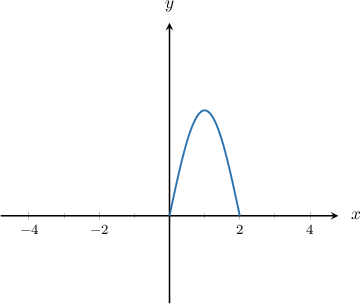

### Worked solution

The graph above shows the function in the interval

$$
0 \leq x \leq 2
$$

Since this interval has length $2$, and the period of the function is also $2$, this interval represents a single period of the function.

Therefore, the function will consist of many copies of the shape shown above, shifted horizontally by multiples of $2$.

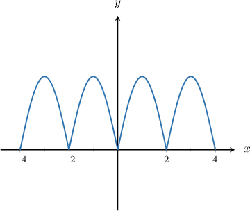

## q-41416

Source: existing database content

Difficulty: not recorded

### Problem

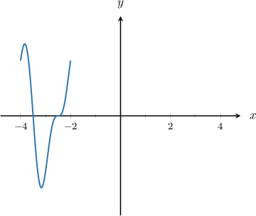

Part of the graph of a function $y = f(x)$ with period $2$ is shown above. What is the graph of $y = f(x)$ on the interval $-4 \le x \le 4$?

### Worked solution

### Answer field `selection` (radio)

1. 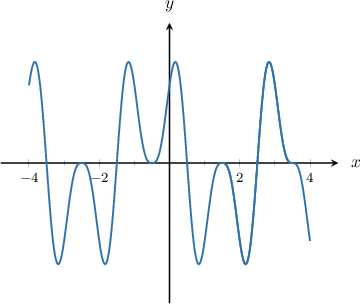

2. 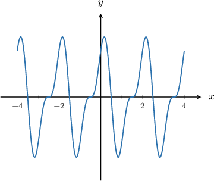 **[stored correct answer]**

3. 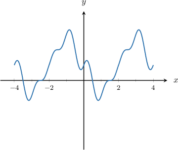

4. 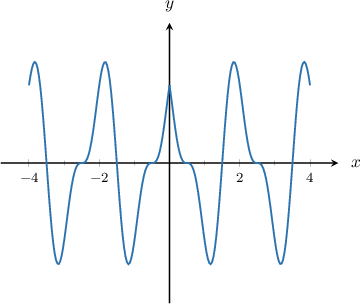

5. 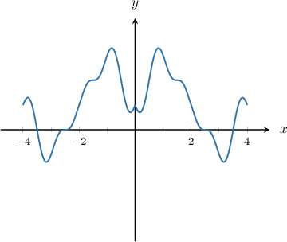

## q-60925

Source: existing database content

Difficulty: not recorded

### Problem

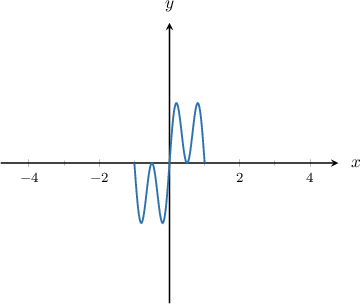

Part of the graph of a function $y = f(x)$ with period $2$ is shown above. What is the graph of $y = f(x)$ on the interval $-4 \le x \le 4$?

### Worked solution

### Answer field `selection` (radio)

1. 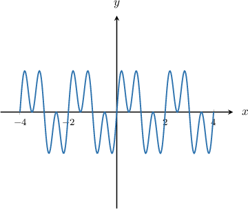 **[stored correct answer]**

2. 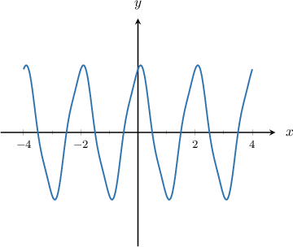

3. 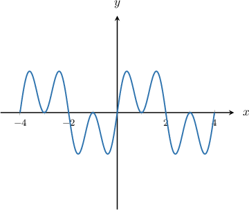

4. 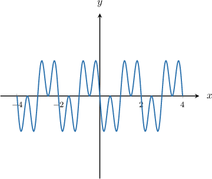

5. 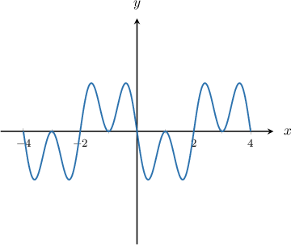

## Additional captured historical questions

## q-51568 — missing answer graph

Source: completed historical activity

Difficulty: easy

### Problem

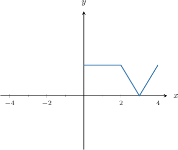

Part of the graph of a function $y=f(x)$ with period $4$ is shown above. What is the graph of $y=f(x)$ on the interval $-4\le x\le 4?$

### Worked solution

The graph above shows the function in the interval $0\le x\le 4.$

Since this interval has length $4,$ and the period of the function is also $4,$ this interval represents a single period of the function.

Therefore, the function will consist of many copies of the shape shown above, shifted horizontally by multiples of $4.$

## q-41423

Source: completed historical activity

Difficulty: easy

### Problem

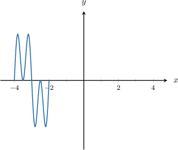

Part of the graph of a function $y=f(x)$ with period $2$ is shown above. What is the graph of $y=f(x)$ on the interval $-4\le x\le 4?$

### Worked solution

The graph above shows the function in the interval $-4\le x\le -2.$

Since this interval has length $2,$ and the period of the function is also $2,$ this interval represents a single period of the function.

Therefore, the function will consist of many copies of the shape shown above, shifted horizontally by multiples of $2.$

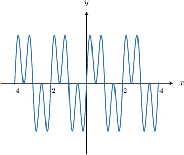

