# Plotting a Quadratic Function Where X Is a Function of Y

Topic ID: 2978

Knowledge-point UUID: `1f2981f6-bfbf-5c1e-a4a2-2814dc24804a`

Questions needing reconstruction: `q-88515`, `q-88500`

## Existing database examples and questions

## e-7822

Source: existing database content

Difficulty: not recorded

### Problem

Plot the graph of $x=-2y^2 - 3y$.

### Worked solution

To plot $x=-2y^2-3y$, we will first plot the function $y=-2x^2-3x$ and then reflect it over the line $y=x$.

The curve $y=-2x^2-3x$ is a parabola. It has the following factored form:

$$
y = -x(2x+3)
$$

From the factored form above, we see that we have a negative parabola with roots at $x=0$ and

$$
x=-\dfrac32
$$

Therefore, we get the following graph:

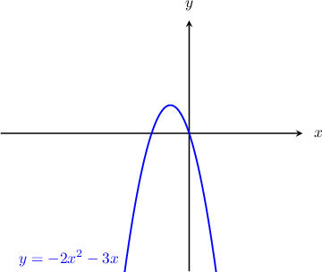

Now, to get the curve $x=-2y^2-3y$, we just have to reflect the curve $y=-2x^2-3x$ over the line $y=x$, as follows:

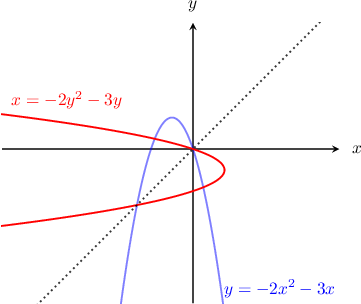

## q-88341

Source: existing database content

Difficulty: not recorded

### Problem

Plot the graph of $x = y^{2} - 2y$.

### Worked solution

### Answer field `selection` (radio)

1. 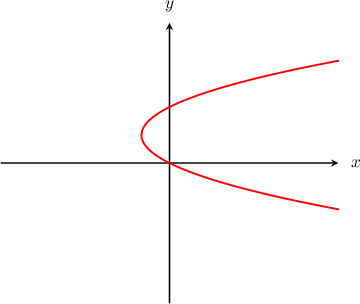 **[stored correct answer]**

2. 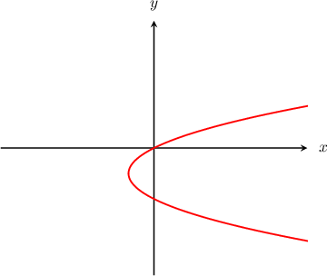

3. 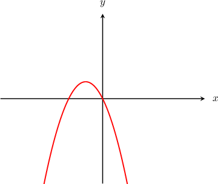

4. 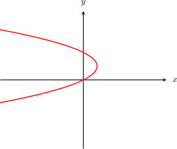

5. 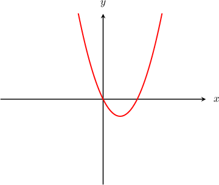

## q-88507

Source: existing database content

Difficulty: not recorded

### Problem

Plot the graph of $x =-y^{2} - 3y$.

### Worked solution

### Answer field `selection` (radio)

1. 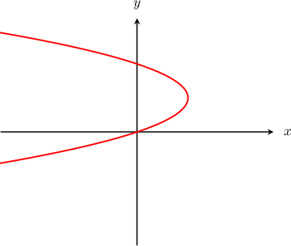

2. 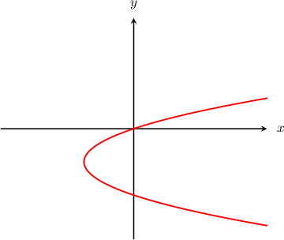

3. 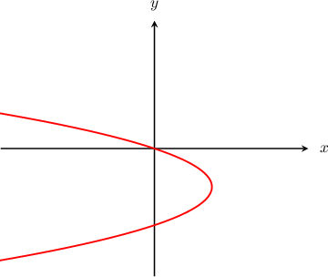 **[stored correct answer]**

4. 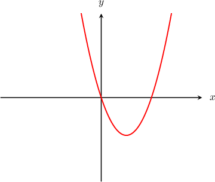

5. 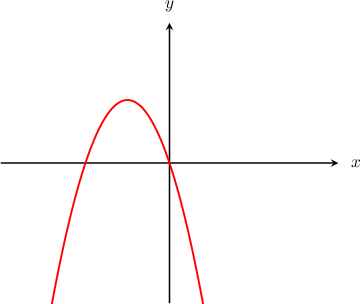

## Additional captured historical questions

## q-88515 — missing answer graph

Source: completed historical activity

Difficulty: moderate

### Problem

Which of the following represents the graph of $x=6{y}^{2}+10y?$

### Worked solution

To plot $x=6{y}^{2}+10y,$ we will first plot the function $y=6{x}^{2}+10x$ and then reflect it over the line $y=x.$

The curve $y=6{x}^{2}+10x$ is a parabola. It has the following factored form:

$$
y=2x(3x+5)
$$

From the factored form above, we get the following graph:

Now, to get the curve $x=6{y}^{2}+10y,$ we just have to reflect the curve $y=6{x}^{2}+10x$ over the line $y=x,$ as follows:

## q-88500 — missing answer graph

Source: completed historical activity

Difficulty: moderate

### Problem

Plot the graph of $x={y}^{2}-3y.$

### Worked solution

To plot $x={y}^{2}-3y,$ we will first plot the function $y={x}^{2}-3x$ and then reflect it over the line $y=x.$

The curve $y={x}^{2}-3x$ is a parabola. It has the following factored form:

$$
y=x(x-3)
$$

From the factored form above, we get the following graph:

Now, to get the curve $x={y}^{2}-3y,$ we just have to reflect the curve $y={x}^{2}-3x$ over the line $y=x,$ as follows:

