# Determining Whether a Function Is Continuous at a Given Point

Topic ID: 462

Knowledge-point UUID: `6cd6c125-ecaf-5847-a802-ec1b3594a15c`

Questions needing reconstruction: `q-48086`

## Existing database examples and questions

## e-3567

Source: existing database content

Difficulty: not recorded

### Problem

Is the function $y=f(x)$, plotted below, continuous at $x=0$?

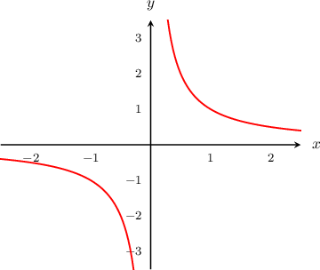

### Worked solution

Because there is an asymptote at $x=0$, it is impossible to draw the function in the neighborhood of $x=0$ without taking our pencil off of the paper.

Therefore, the function $y=f(x)$ is not continuous at $x=0$.

## q-102115

Source: existing database content

Difficulty: moderate

### Problem

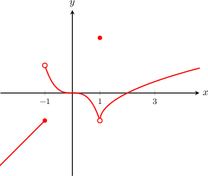

The curve $y=f(x)$ is shown above. At which of the following points is $f(x)$ continuous?

- $x=-1$
- $x=1$
- $x=3$

### Worked solution

Let's consider each point separately.

- The function $f(x)$ is not continuous at $x=-1.$ Since there is a jump at $x=-1,$ it is impossible to draw the function in the neighborhood of $x=-1$ without taking our pencil off of the paper.

- The function $f(x)$ is not continuous at $x=1.$ Since there is a break at $x=1,$ it is impossible to draw the function in the neighborhood of $x=1$ without taking our pencil off of the paper.

- The function $f(x)$ is continuous at $x=3.$ The graph can be drawn in the neighborhood of $x=3$ without taking our pencil off of the paper.

Hence, the correct answer is  "III only".

 

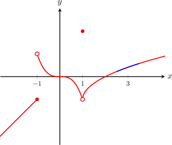

### Answer field `selection` (radio)

1. II and III only

2. I and III only

3. I only

4. III only **[stored correct answer]**

5. II only

## q-48039

Source: existing database content

Difficulty: easy

### Problem

Select the function that is continuous at $x =-2$.

### Worked solution

The correct answer is shown below. Despite the fact that the function has a discontinuity at $x=1$, the graph can be drawn in the neighborhood of $x=-2$ without taking our pencil off of the paper.

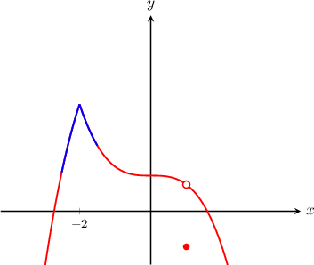

All the other given graphs contain breaks at $x=-2$ and it would be impossible to draw them in the neighborhood of $x=-2$ without taking the pencil off of the paper.

### Answer field `selection` (radio)

1. 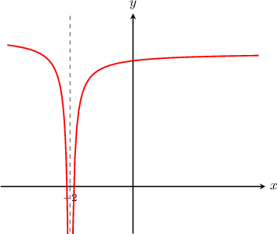

2. 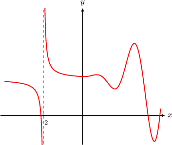

3. 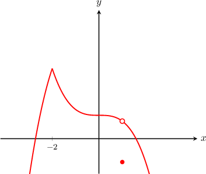 **[stored correct answer]**

4. 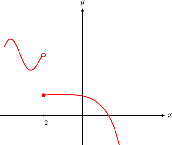

5. 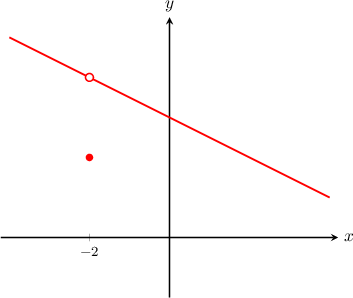

## q-48081

Source: existing database content

Difficulty: not recorded

### Problem

Select the function that is continuous at $x = 2$.

### Worked solution

### Answer field `selection` (radio)

1. 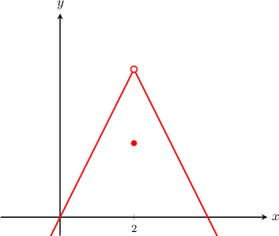

2. 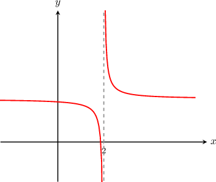

3. 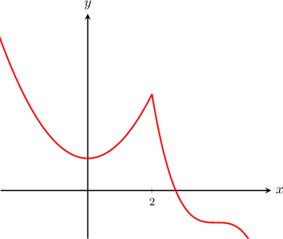 **[stored correct answer]**

4. 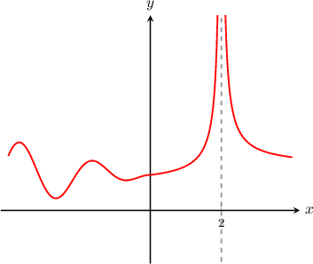

5. 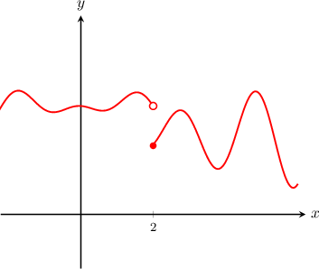

## q-48082

Source: existing database content

Difficulty: easy

### Problem

Select the function that is continuous at $x=0.$

### Worked solution

The correct answer is shown below.  Indeed, despite the fact that the function has a discontinuity at $x=2$, the graph can be drawn in a neighborhood of $x=0$ without taking our pencil off of the paper.

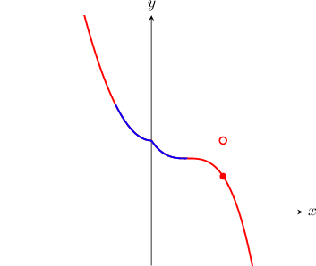

   

All the other given graphs contain breaks at $x=0$ and it would be impossible to draw them in a neighborhood of $x=0$ without taking the pencil off of the paper.

### Answer field `selection` (radio)

1. 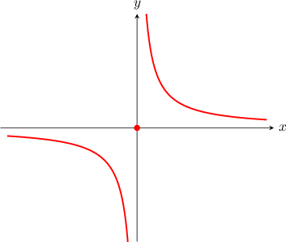

2. 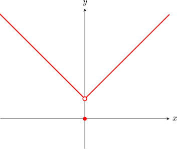

3. 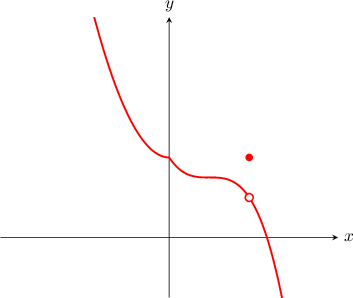 **[stored correct answer]**

4. 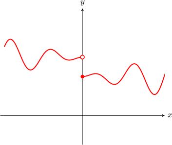

5. 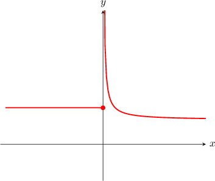

## q-69782

Source: existing database content

Difficulty: easy

### Problem

Select the function that is continuous at $x=5.$

### Worked solution

Of the given options, the only one where we can draw the graph of the function without taking our pencil off of the paper in a neighborhood of $x=5$ is shown below.

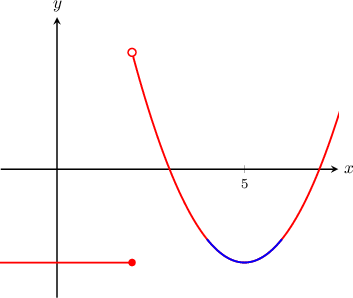

All other given options have breaks or asymptotes at $x=5$, so it is impossible to draw the function in the neighborhood of $x=5$ without taking our pencil off of the paper.

### Answer field `selection` (radio)

1. 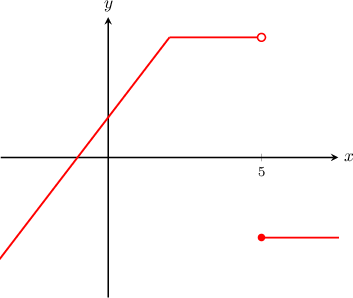

2. 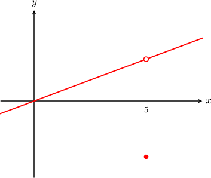

3. 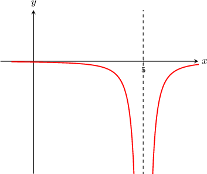

4. 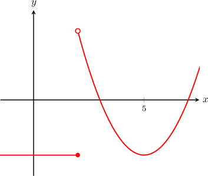 **[stored correct answer]**

5. 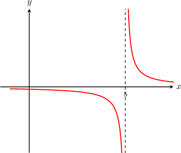

## q-78132

Source: existing database content

Difficulty: moderate

### Problem

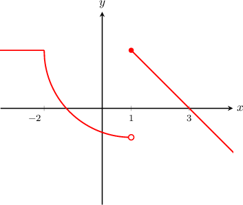

The curve $y=f(x)$ is shown above. At which of the following points is $f(x)$ continuous?

- $x=-2$
- $x=1$
- $x=3$

### Worked solution

Let's consider each point separately.

- The function $f(x)$ is continuous at $-2.$ The graph can be drawn in the neighborhood of $x=-2$ without taking our pencil off of the paper.

- The function $f(x)$ is not continuous at $x=1.$ Since there is a jump at $x=1,$ it is impossible to draw the function in the neighborhood of $x=1$ without taking our pencil off of the paper.

- Therefore, the function $f(x)$ is continuous $x=3.$ The graph can be drawn in the neighborhood of  $x=3$ without taking our pencil off of the paper.

Hence, the correct answer is  "I and III only".

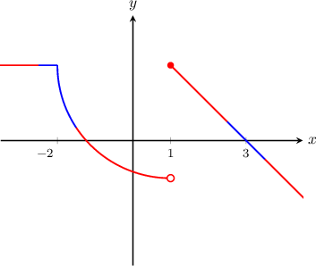

### Answer field `selection` (radio)

1. II and III only

2. I and III only **[stored correct answer]**

3. I only

4. III only

5. I and II only

## Additional captured historical questions

## q-48086 — missing answer graph

Source: completed historical activity

Difficulty: easy

### Problem

Select the function that is continuous at $x=3.$

### Worked solution

The correct answer is shown below.  Indeed, the graph can be drawn in a neighborhood of $x=3$ without taking our pencil off of the paper.

All the other given graphs contain breaks at $x=3$ and it would be impossible to draw them in a neighborhood of $x=3$ without taking the pencil off of the paper.

## q-69780

Source: completed historical activity

Difficulty: easy

### Problem

Select the function that is continuous at $x=-1.$

### Worked solution

Of the given options, the only one where we can draw the graph of the function without taking our pencil off of the paper in a neighborhood of $x=-1$ is shown below.

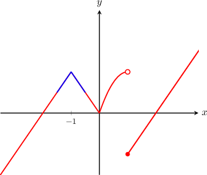

All other given options have breaks or asymptotes at $x=-1$, so it is impossible to draw the function in the neighborhood of $x=-1$ without taking our pencil off of the paper.

## q-102091

Source: completed historical activity

Difficulty: easy

### Problem

Select the function that is continuous at $x=4.$

### Worked solution

The correct answer is shown below.  Indeed, the graph can be drawn in a neighborhood of $x=4$ without taking our pencil off of the paper.

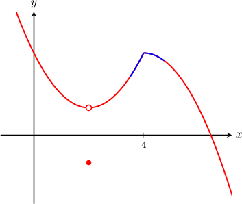

All the other given graphs contain breaks at $x=4$ and it would be impossible to draw them in a neighborhood of $x=4$ without taking the pencil off of the paper.

## q-102106

Source: completed historical activity

Difficulty: moderate

### Problem

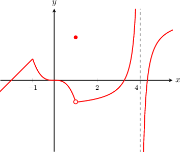

The curve $y=f(x)$ is shown above. At which of the following points is $f(x)$ continuous?

I. - $x=-1$
II. - $x=2$
III. - $x=4$

### Worked solution

Let's consider each point separately.

- The function $f(x)$ is continuous at $x=-1.$ The graph can be drawn in the neighborhood of $x=-1$ without taking our pencil off of the paper.

- The function $f(x)$ is continuous at $x=2.$ The graph can be drawn in the neighborhood of $x=2$ without taking our pencil off of the paper.

- The function $f(x)$ is not continuous at $x=4.$ Since there is an asymptote at $x=4,$ it is impossible to draw the function in the neighborhood of $x=4$ without taking our pencil off of the paper.

Hence, the correct answer is  "I and II only".

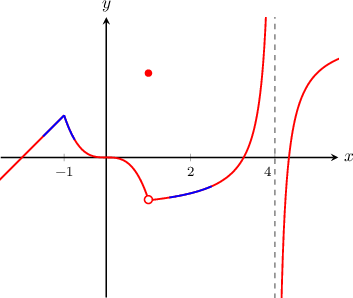

## q-78133

Source: completed historical activity

Difficulty: moderate

### Problem

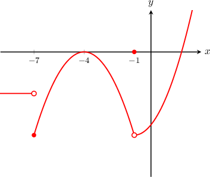

The curve $y=f(x)$ is shown above. At which of the following points is $f(x)$ continuous?

I. - $x=-7$
II. - $x=-4$
III. - $x=-1$

### Worked solution

Let's consider each point separately.

- The function $f(x)$ is not continuous at $x=-7.$ Because there is a jump at $x=-7,$ it is impossible to draw the function in the neighborhood of $x=-7$ without taking our pencil off of the paper.

- The function $f(x)$ is continuous at $x=-4.$ The graph can be drawn in the neighborhood of $x=-4$ without taking our pencil off of the paper.

- The function $f(x)$ is not continuous at $x=-1.$ Since there is a break at $x=-1,$ it is impossible to draw the function in the neighborhood of $x=-1$ without taking our pencil off of the paper.

Hence, the correct answer is: "II only".

