# Determining the Image of a Polygon Under the Action of Multiple Transformations

Topic ID: 483

Knowledge-point UUID: `9322724c-215a-5a91-a478-e91abe4038da`

Questions needing reconstruction: `q-88400`

## Existing database examples and questions

## e-7747

Source: existing database content

Difficulty: not recorded

### Problem

The triangle shown above is rotated by $90^{\circ}$ counterclockwise about the origin and then reflected across the $x$-axis. What is the resulting triangle?

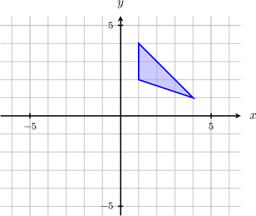

### Worked solution

Let's apply the given transformation.

- Rotating the triangle by $90^{\circ}$ counterclockwise about the origin gives the following:

- Next, we take the last result and reflect it across the $x$-axis.

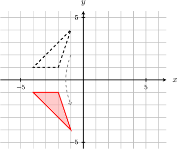

## q-45184

Source: existing database content

Difficulty: not recorded

### Problem

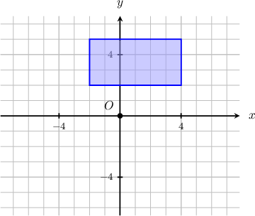

The polygon shown above is reflected in the $y$-axis and then dilated with center $O$ and scale factor $\frac{1}{2}$. What is the resulting polygon?

### Worked solution

### Answer field `selection` (radio)

1. 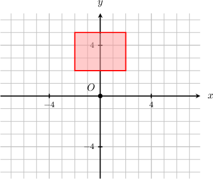

2. 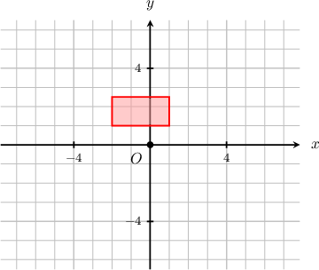 **[stored correct answer]**

3. 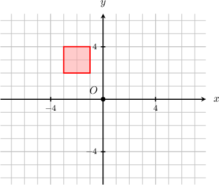

4. 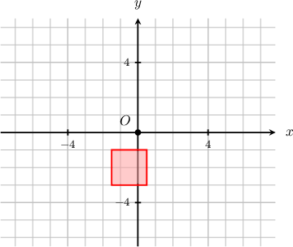

5. 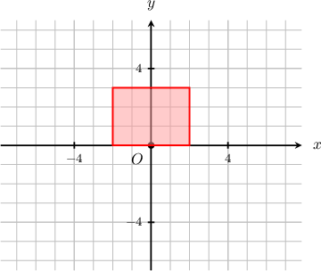

## q-45397

Source: existing database content

Difficulty: not recorded

### Problem

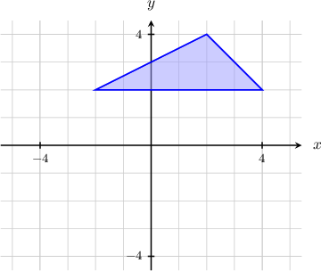

The triangle shown above is transformed subsequently by functions $f_{1}(x, y) ↦ (\frac{x}{2}, \frac{y}{2})$ and $f_{2}(x, y) ↦ (x,-y)$. What is the resulting triangle?

### Worked solution

### Answer field `selection` (radio)

1. 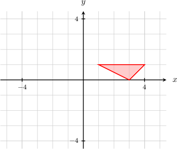

2. 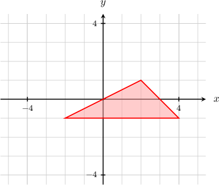

3. 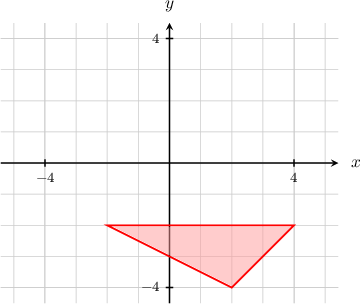

4. 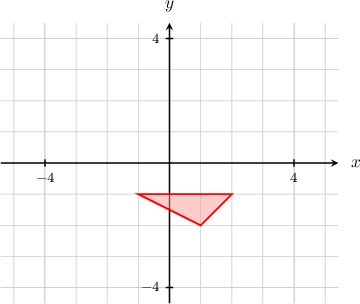 **[stored correct answer]**

5. 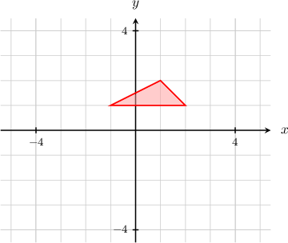

## Additional captured historical questions

## q-88400 — missing answer graph

Source: completed historical activity

Difficulty: moderate

### Problem

The triangle shown above is transformed subsequently by functions ${f}_{1}(x,y)↦(x-2,y)$ and ${f}_{2}(x,y)↦(-x,y).$ What is the resulting triangle?

### Worked solution

Let's apply the given transformation.

- Applying the transformation ${f}_{1}(x,y)↦(x-2,y)$ gives the following:

- Next, we apply the second transformation, ${f}_{2}(x,y)↦(-x,y).$ This gives the following:

