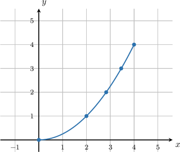
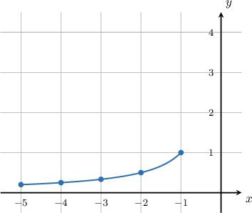

# Questions needing reconstructed answer graphs

## q-123789 — missing answer graph

Source: completed historical activity

Difficulty: easy

### Problem

Determine the graph of the following parametrically defined curve:

$$
x=2\sqrt{t},\,y=t,\,0\le t\le 4
$$

### Worked solution

We need to create a table of values and then sketch the curve. First, we work out the $x$-values using the formula $x=2\sqrt{t}.$ This gives

| **$t$** | $0$ | $1$ | $2$ | $3$ | $4$ |
| --- | --- | --- | --- | --- | --- |
| $x$ | $0$ | $2$ | $2.83$ | $3.46$ | $4$ |
| $y$ | $$ | $$ | $$ | $$ | $$ |

$$

$$

Now, we work out the $y$ values using $y=t.$ This gives

| **$t$** | $0$ | $1$ | $2$ | $3$ | $4$ |
| --- | --- | --- | --- | --- | --- |
| $x$ | $0$ | $2$ | $2.83$ | $3.46$ | $4$ |
| $y$ | $0$ | $1$ | $2$ | $3$ | $4$ |

$$

$$

Plotting these points, we obtain the following curve:

## q-123788 — missing answer graph

Source: completed historical activity

Difficulty: easy

### Problem

Determine the graph of the following parametrically defined curve:

$$
x=t,\,y=-\frac{1}{t},\,-5\le t\le -1
$$

### Worked solution

We need to create a table of values and then sketch the curve. First, we work out the $x$-values using the formula $x=t.$ This gives

| **$t$** | $-5$ | $-4$ | $-3$ | $-2$ | $-1$ |
| --- | --- | --- | --- | --- | --- |
| $x$ | $-5$ | $-4$ | $-3$ | $-2$ | $-1$ |
| $y$ | $$ | $$ | $$ | $$ | $$ |

$$

$$

Now, we work out the $y$ values using $y=-\frac{1}{t}.$ This gives

| **$t$** | $-5$ | $-4$ | $-3$ | $-2$ | $1$ |
| --- | --- | --- | --- | --- | --- |
| $x$ | $-5$ | $-4$ | $-3$ | $-2$ | $-1$ |
| $y$ | $\frac{1}{5}$ | $\frac{1}{4}$ | $\frac{1}{3}$ | $\frac{1}{2}$ | $1$ |

$$

$$

Plotting these points, we obtain the following curve:

