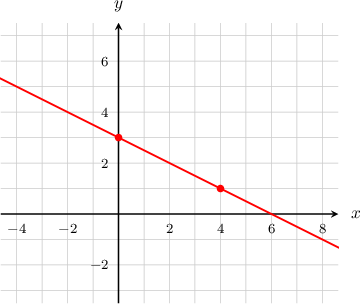
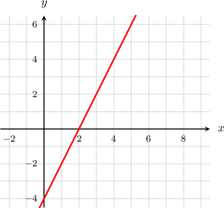
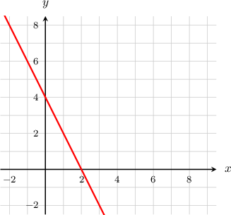
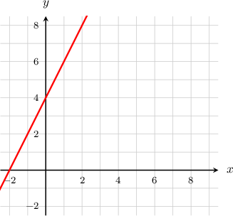
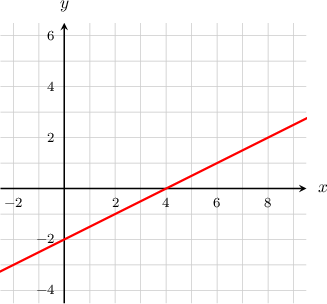
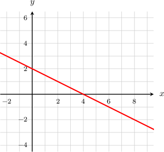
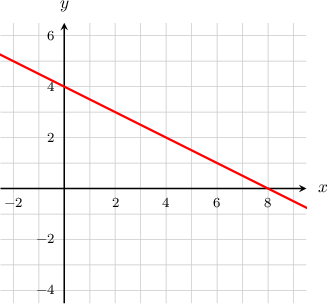
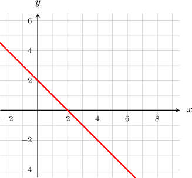
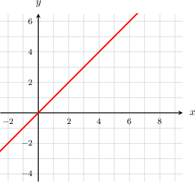

# Sketching a Line Using Two Points

Topic ID: 95

Knowledge-point UUID: `ebeb4e5a-adbe-5a94-b05d-61933a687892`

Questions needing reconstruction: `q-71805`

## Existing database examples and questions

## e-984

Source: existing database content

Difficulty: not recorded

### Problem

Sketch the graph of $y=-\dfrac{1}{2}x+3$.

### Worked solution

We need to find two distinct points that lie on our line. Any two points will do!

It is often easiest to pick one of the points to have an $x$-coordinate of $x=0$. So, for the first point, we will let the $x$-coordinate be $x=0$. Then the $y$-coordinate is

$$
\begin{aligned}
y &= -\frac{1}{2}x + 3 \\
&=-\frac{1}{2}(0) + 3 \\
&= 0 + 3 \\
&= 3
\end{aligned}
$$

So, the first point is $(0,3)$.

For the second point, let's choose $x=4$. Then the $y$-coordinate is

$$
\begin{aligned}
y &= -\frac{1}{2}x + 3 \\
&=-\frac{1}{2}(4) + 3 \\
&=-2 + 3 \\
&= 1
\end{aligned}
$$

So, the second point is $(4,1)$.

Finally, we plot those two points on the $xy$-plane and draw a line through them. This is the graph of

$$
y=-\dfrac{1}{2}x+3
$$

## q-54286

Source: existing database content

Difficulty: not recorded

### Problem

Which of the following graphs shows the line $y = 2x - 4$?

### Worked solution

### Answer field `selection` (radio)

1.  **[stored correct answer]**

2. 

3. 

4. 

5. 

## q-59678

Source: existing database content

Difficulty: not recorded

### Problem

Which of the following graphs shows the line $y = \frac{1}{2}x - 2$?

### Worked solution

### Answer field `selection` (radio)

1. 

2.  **[stored correct answer]**

3. 

4. 

5. 

## Additional captured historical questions

## q-71805 — missing answer graph

Source: completed historical activity

Difficulty: easy

### Problem

Which of the following graphs shows the line $y=-3x+4?$

### Worked solution

We need to find two distinct points that lie on our line. Any two points will do!

- For the first point, we will let the $x$-coordinate be $x=0.$ Then the $y$-coordinate is

$$
\begin{aligned}y & =-3x+4 \\  & =-3(0)+4 \\  & =4.\end{aligned}
$$

So, the first point is$(0,4).$

- For the second point, we will let the $x$-coordinate be  $x=2.$ Then the $y$-coordinate is

$$
\begin{aligned}y & =-3x+4 \\  & =-3(2)+4 \\  & =-2.\end{aligned}
$$

So, the second point is $(2,-2).$

Finally, we plot those two points on the $xy$-plane and draw a line through them. This is the graph of $y=-3x+4.$

