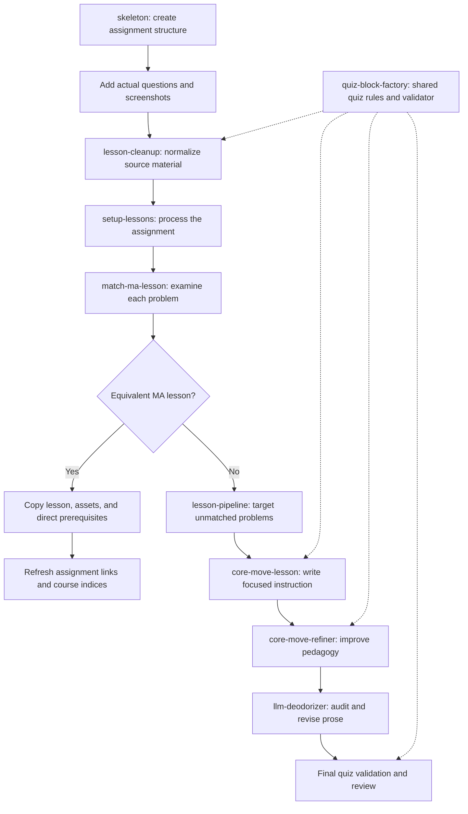

# Study Skills Review — Version 1

Review date: September 26, 2026

## Scope and evidence

This review examines the original skills in `/home/jake/Developer/study/util/skills`, rather than the copy in Course Academy. It covers nine skills and their supporting references, scripts, schemas, examples, and interface definitions.

Excluded from this review:

- `create-course-map`
- `gather-course-information`

The review describes the intended workflow and checks important implementation details. It does not demonstrate a complete live assignment run. No source skills, assignments, or Math Academy lessons were modified.

## Collective goal

The skills turn real assignments into usable Obsidian study packages. They preserve the source questions, produce interactive assessment with corrective feedback, attach suitable lessons and prerequisites, and connect copied lesson material to course navigation and progress tracking.

The assignment drives the instruction. Each problem is examined for the specific reasoning or mathematical action it requires. The system first tries to reuse an equivalent Math Academy lesson. If none exists, it generates focused instruction for that problem.

The intended result is a study environment in which every assignment problem has relevant instructional coverage. The generated-lesson branch currently has a registration gap: creating a lesson file does not necessarily connect it to assignment navigation or course progress indices.

## Overall sequence



The sequence from skeleton through cleanup to setup is inferred from their input and output contracts. No single included skill automatically invokes that entire sequence. Adding the actual source questions is an external input step; the skeleton does not retrieve or invent them.

The sequence within `setup-lessons` is explicit: classify problems, finish the Math Academy copy-helper invocations, then invoke targeted generation for unmatched problems. The generated-lesson sequence is also explicit: generation, refinement, prose audit, and final verification.

## Responsibilities of the nine skills

| Skill | Responsibility | Result or handoff |
|---|---|---|
| `skeleton` | Create an assignment structure with numbered placeholders. | Assignment Markdown and sibling `Lessons`, `Prerequisites`, and `Source/<document>/Images` folders. |
| `lesson-cleanup` | Normalize rough questions, screenshots, Markdown, quiz representation, and numerical precision. | Clean source assessment material; matching and generation remain separate. |
| `setup-lessons` | Coordinate instructional coverage across one assignment. | Local MA lesson copies and prerequisites, followed by generated fallbacks for unmatched problems. |
| `match-ma-lesson` | Verify whether candidate MA examples or questions teach the source problem's task. | Explicit equivalent/unmatched status with file and line evidence. |
| `lesson-pipeline` | Coordinate generation for all or explicitly selected missing problem lessons. | Validated `Lessons/Problem-N.md` files. |
| `core-move-lesson` | Identify one teachable move and build instruction and practice around it. | Focused lesson with worked examples, quizzes, and a reusable summary. |
| `core-move-refiner` | Compare a draft with existing MA lessons and apply transferable teaching patterns. | Improved progression, examples, practice, distractors, and feedback. |
| `llm-deodorizer` | Audit and repair generic, unsupported, artificial, or empty prose. | Clearer writing while preserving the lesson's facts and structural contract. |
| `quiz-block-factory` | Own quiz type selection, canonical representation, correctness encoding, feedback standards, and validation. | Shared assessment contract used by cleanup, generation, and refinement. |

## Preparing the source assignment

### Skeleton

`skeleton` accepts a course folder, document name, and positive problem count. Its CLI creates the assignment note and the directory layout used by the downstream skills:

```text
Assignment/
├── Assignment.md
├── Lessons/
├── Prerequisites/
└── Source/
    └── Assignment/
        └── Images/
```

The note has top-level prerequisite and lesson links plus `## Problem N` placeholders. Existing folders and notes are protected from replacement by default. The skill prefers the repository wrapper, which delegates to its bundled creation script.

### Lesson Cleanup

Despite its name, this skill primarily cleans source assignments and lecture quizzes. It explicitly excludes running lesson matching or generation and protects existing lessons, prerequisites, and unrelated source packages.

Its work includes:

- Preserving problem order, givens, notation, units, supplied choices, known answer keys, and independently answerable subparts.
- Converting rough assessment material into canonical quiz blocks using Quiz Block Factory.
- Keeping shared multipart context and diagrams in one place.
- Auditing image references and exact-byte, decoded-pixel, and visual-similarity duplicate candidates.
- Moving document-owned images into the canonical image directory and assigning descriptive names.
- Independently checking arithmetic, units, significant figures, and keyboard-enterable blank answers.
- Reporting genuinely unknown answer keys and resulting validation failures instead of inventing correctness.

The image audit identifies candidates; uncertain visual similarity still requires inspection. Cleanup requires updating references before removing confirmed redundant files.

Cleanup may also be used later, after new source questions or screenshots are added. It is not limited to an initial preparation pass.

## Matching and reusing Math Academy lessons

### Match MA Lesson: the judgment step

`match-ma-lesson` operates on an atomic problem. It extracts the action, requested output, givens, constraints, representation, and prerequisite facts. It searches scoped MA catalogs, expands to lesson-text searches when needed, and opens candidate lessons to inspect their examples and questions.

A matching title or shared vocabulary is insufficient. The strongest evidence is an example or question that teaches the same core move with substantially the same task shape. Relevant comparisons include:

- Mathematical action: compute, solve, estimate, graph, simplify, prove, or interpret.
- Representation: equation, table, graph, interval, sigma notation, or word problem.
- Answer form and constraints: exact value, decimal approximation, multiple choice, or a restriction on what may be computed.

The matcher separates equivalent lessons from prerequisites and near misses. It returns exactly one status:

- `Equivalent Math Academy lesson found`
- `No equivalent Math Academy lesson`

For unmatched assignment problems, it names a targeted `lesson-pipeline` fallback. The assignment-level caller owns invoking that fallback.

### Setup Lessons: assignment-level coordination

`setup-lessons` splits the assignment into its `## Problem N` blocks and matches one problem at a time. It maintains explicit matched and unmatched problem-number lists. Every problem must belong to exactly one list.

Supporting prerequisites or near misses do not count as equivalent coverage. This prevents a broadly related lesson from suppressing a needed generated fallback.

For verified matches, `copy_ma_lesson.py` performs the integration work:

- Copies the indexed lesson Markdown and source asset folder.
- Adds direct prerequisites of explicitly selected lessons, without recursively expanding the entire prerequisite graph.
- Records topic identities and roles in assignment `Source/topics.csv`.
- Deduplicates copies and upgrades a prerequisite's role when it becomes a main lesson.
- Canonicalizes local lesson and source names using topic name and ID.
- Repairs source, prerequisite, and course-navigation links in local copies.
- Replaces skeleton links with local links sorted by study layer.
- Refreshes course `topics.csv`, `prerequisites.csv`, TOC, and Home.
- Updates the installed progress-plugin configuration when available, including `queuePrerequisiteScope: "course"`.

Copy-helper invocations must run sequentially for the same assignment because they rewrite shared links and indices.

After copying finishes, setup invokes the lesson pipeline with the exact unmatched problem numbers, unless the user requested an MA-only pass. A lesson reused across several problems is copied once.

## Generating missing instruction

### Lesson Pipeline: scope and coordination

The pipeline supports full-assignment mode and targeted mode. Its expected generated lesson for Problem N is `Lessons/Problem-N.md` beside the assignment.

A missing or zero-byte expected file needs work. An existing nonempty file is skipped unless regeneration is explicitly requested. Targeted mode verifies that supplied problem numbers exist and never adds extra targets merely because other expected files are missing.

When used by `setup-lessons`, targeted mode is mandatory. Copied MA lessons have topic-title filenames, so full mode would incorrectly treat matched problems as needing additional generated lessons.

The prescribed execution model uses one same-model worker per missing problem, with each worker owning one lesson file. Workers can run concurrently because their write scopes are disjoint. The coordinator inspects results and repeats final checks, and retries failed problems or completes them locally using the same sequence.

### Core Move Lesson: establish the instructional spine

A core move is a concrete, operational action narrower than a course topic. The analysis identifies:

- The action the student must perform.
- The recognition cue that signals when it applies.
- The requested output and given structure.
- The minimum prerequisite knowledge.
- Likely failure modes and controlled variant axes.

The lesson starts with minimal direct instruction and a canonical worked example. Later sections deepen the same move by changing one dimension at a time, such as numbers, signs, representation, conditions, or a common trap.

The intended loop is: demonstrate the local move, ask the student to perform a close variant, give corrective feedback, then introduce one controlled extension. Practice sits immediately after the explanation it reinforces.

The Markdown contract includes a title, table of contents, prerequisites, introduction, focused sections, worked examples, quiz practice, and summary. Most lessons should have three to six focused sections. Student-facing material should teach the subject without discussing pipeline mechanics.

### Core Move Refiner: improve the pedagogy

The refiner studies approximately four existing MA lessons, with relevant comparisons preferred when the topic is clear. It looks at progression, prerequisite scope, recognition cues, example length, practice placement and density, controlled variation, distractors, summaries, and useful representations.

It applies structural and pedagogical patterns without copying MA wording or proprietary question content. The result must be an improved lesson, not only a critique. It preserves the original core move and source facts and keeps quiz IDs stable and unique within the file.

### LLM Deodorizer: revise the final prose

The deodorizer runs after pedagogical refinement. It scans for lexical hotspots, reads its failure-point reference, audits the entire artifact semantically, makes warranted edits, scans again, and reviews the diff.

The scanner is a set of review leads, not proof of authorship or editorial quality. A clean scan does not establish that the prose is useful or accurate. The semantic audit examines unsupported claims, absent evidence, vague actors, inflated importance, abstract non-analysis, generic structure, terminology drift, and drafting artifacts.

Within the pipeline, its edits must preserve facts, numerical values, mathematics, correct answers, quiz schemas and IDs, links, citations, frontmatter, progress metadata, headings, explicit anchors, table of contents, and lesson navigation.

### Final checks

The worker validates after deodorizing. The coordinator also checks lesson existence, scanner findings in context, strict quiz validation, and scoped whitespace errors. The sequence matters: final checks apply to the final edited lesson, rather than only to an earlier draft.

## Quiz Block Factory: a shared dependency

The factory is consulted before quiz creation or modification. It is not simply a conversion step at the end of the workflow.

It defines seven response types:

| Type | Response shape |
|---|---|
| `radio` | One correct fixed choice. |
| `checkbox` | Multiple independently correct fixed choices. |
| `select` | Several prompts sharing one choice bank. |
| `multi-select` | Several prompts with separate choice banks; each prompt selects one answer. |
| `noodle` | One-to-one matching. |
| `free` | Open response, derivation, proof, drawing, or explanation. |
| `blank` | One or more short determinate typed responses. |

The canonical representation uses explicit text IDs, `content`, supported fields only, and renderer-specific correctness and feedback locations. Compatibility aliases accepted by the plugin are not canonical authoring format.

Feedback is part of the instruction. Correct-answer feedback explains the governing rule, applies it to the prompt, and reaches the requested conclusion. Distractor feedback repairs the particular error represented by the selected choice. It must not invent a student's thought process when a supplied distractor's origin is unclear.

For typed mathematical blanks, keyboard-enterable answers are separate from polished display notation. Exact math grading is structural rather than algebraically equivalent, so reveal-only mode may be appropriate when many equivalent answer forms are valid.

The factory validator checks canonical fields, scalar types, cardinality, IDs, answer references, matching bijections, feedback placement, feedback presence, and some shallow feedback patterns. It does not certify mathematical correctness or pedagogical quality. Independent content review remains necessary.

The old validator in `core-move-lesson` delegates to the factory validator, avoiding a second independent implementation.

## Separate daily-lecture cleanup branch

Lecture cleanup uses canonical PRE and LEC source notes and a dated root note that embeds them:

```text
2026-06-24-M1-1/
├── 2026-06-24-M1-1.md
└── Source/
    ├── M1-1-PRE.md
    ├── M1-1-LEC.md
    └── Images/
```

The source notes own quiz content and reference shared images. The dated root composes those sources rather than duplicating their quizzes. Missing or empty sources are omitted.

This is a cleanup branch, not the assignment lesson-generation sequence. PRE and LEC do not use assignment `## Problem N` anchors and are not automatically routed through setup or generation.

## Findings and limitations

### 1. Generated lessons lack a complete registration handoff

MA copies receive assignment links, topic records, prerequisite relationships, and course navigation/progress integration. Generated fallback lessons are required to exist and pass validation, but the reviewed generation workflow does not prescribe registering them in those systems.

The copy helper rebuilds course topics from assignment `Source/topics.csv` records. It preserves previously indexed local/generated rows whose files still exist, but does not discover and register new `Problem-N.md` files. Setup refreshes indices during the copy phase, before fallback generation.

Consequence: problem coverage can be complete as files while assignment links, course queues, or progress tracking omit the newly generated instruction. A later refresh alone does not resolve missing topic registration.

Evidence: `setup-lessons/SKILL.md`; `lesson-pipeline/SKILL.md`; `setup-lessons/scripts/copy_ma_lesson.py`, especially `collect_course_topic_rows` at line 1349.

### 2. Radio shuffling policy conflicts across skills

Quiz Block Factory requires every canonical radio block to set `shuffle: true`. Cleanup says to omit shuffling when choice order carries meaning, including order-dependent choices. Those requirements need an explicit reconciliation for faithful source conversion.

The core generation, refinement, and pipeline validation commands also omit `--require-radio-shuffle`, despite the factory's stricter command including it. The lesson-format example and bundled output example omit the shuffle field.

Confirmed check: all three quiz blocks in `core-move-lesson/examples/problem-3-output.md` fail when validated with shuffle enforcement enabled.

### 3. The radio validation flag rejects every other type

Core Move Lesson permits another supported quiz type when the task warrants it. However, the prescribed `--require-radio-practice` flag rejects each block whose type is not `radio`. It enforces an all-radio lesson, rather than merely requiring some radio practice.

Consequence: a lesson can follow the writing instruction's type exception and still fail its prescribed validation. The type policy and validation command should agree.

Evidence: `core-move-lesson/SKILL.md`; `quiz-block-factory/scripts/validate_quiz_blocks.py`, `validate_block` at line 841.

### 4. Existing nonempty files count as coverage without a quality check

The pipeline skips existing nonempty expected lesson files and counts them toward completion. Its required new-lesson validation does not establish the relevance, completeness, or validity of those skipped files.

This protects prior work, but the completion condition proves file presence rather than instructional quality for pre-existing coverage. Reports should distinguish reused files from newly generated and verified lessons.

### 5. Paths and instructional examples have drifted

Several skills and references hard-code `/Users/jake/Developer/study` or other macOS paths, while the original checkout reviewed here is `/home/jake/Developer/study`. These absolute instructions require adaptation on this host.

The bundled output example uses student-facing “core move” language despite the lesson-writing reference prohibiting that terminology. The validation rubric also names a different optional MA comparison location from the refiner's primary vault location.

The schema reference names an installed Quiz Blocks runtime under the macOS path. The corresponding manifest was absent at the translated Linux vault location during this review. Plugin compatibility claims were therefore not independently checked against a live installed runtime on this host.

### 6. Lecture normalization relies on a manual root-content check

The skill requires confirming that the dated root note contains no unique quiz content before replacing duplicated content with embeds. The bundled normalizer checks that source quiz counts remain unchanged but does not enforce the root-content precondition. It constructs and replaces the root note from the sources.

Consequence: the script is appropriate only after the skill's manual preflight. Its source-count check alone does not prove that all root content was preserved.

Evidence: `lesson-cleanup/scripts/normalize_lecture_folder.py`, `process_folder` at line 110.

### 7. Pedagogical and prose quality remain agent judgments

Matching, core-move identification, controlled progression, refinement, and semantic prose auditing are primarily procedural instructions for an agent. Deterministic checks cover only part of the final artifact.

Neither passing the quiz validator nor receiving no prose-scanner findings proves that a lesson teaches the right move, has correct mathematics, or supplies useful corrective feedback. The skills generally acknowledge this boundary and require content review.

## Verification performed

- Read the nine included skill definitions and examined their supporting material.
- Inspected the copy helper's topic collection, role handling, direct prerequisite selection, link integration, and course refresh behavior.
- Inspected skeleton creation, problem splitting, image auditing, lecture normalization, prose scanning, and quiz validation implementation.
- Ran the existing quiz-validator test suite: **37 tests passed**.
- Validated the bundled generated-lesson example with strict IDs, required radio practice, required feedback, feedback lint, and radio shuffle enforcement: **three failures**, all caused by missing `shuffle: true`.
- Did not run assignment creation, MA copying, lesson generation, or live plugin rendering.

## Design implications for Course Academy

These are conclusions from the review, rather than changes made to the skills:

1. Preserve the distinction between source cleanup, equivalent-lesson matching, and focused lesson generation.
2. Keep quiz representation and feedback policy centralized in Quiz Block Factory.
3. Give copied and generated lessons a common registration step so both appear in assignment navigation, prerequisite relationships, and course progress systems.
4. Persist problem-to-lesson coverage explicitly so coverage does not depend solely on filename conventions or transient matched/unmatched lists.
5. Reconcile type and shuffling policies with source fidelity, then use consistent validation commands.
6. Resolve repository-relative paths from the active checkout instead of relying on host-specific absolute paths.
7. Distinguish file-presence completion from newly verified instructional coverage.

## Source locations

All paths below are relative to `/home/jake/Developer/study/util/skills`:

- `skeleton/SKILL.md` and `scripts/create_skeleton.py`
- `lesson-cleanup/SKILL.md`, `references/cleanup-standard.md`, and its audit/normalization scripts
- `setup-lessons/SKILL.md`, `scripts/list_problems.py`, and `scripts/copy_ma_lesson.py`
- `match-ma-lesson/SKILL.md`
- `lesson-pipeline/SKILL.md`
- `core-move-lesson/SKILL.md`, references, schemas, examples, and compatibility validator
- `core-move-refiner/SKILL.md`
- `llm-deodorizer/SKILL.md`, `references/failure-points.md`, and `scripts/scan_prose.py`
- `quiz-block-factory/SKILL.md`, schema/feedback references, JSON schema, validator, and tests
- Included skills' `agents/openai.yaml` interface definitions
