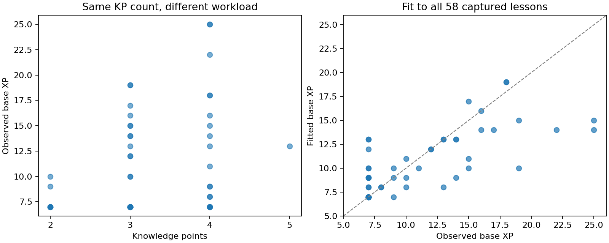

# Base XP: findings and selected formula

**Date:** October 4, 2026  
**Selected model:** `duration_1_2_4_full_content`  
**Scope:** lesson base XP, calibrated to all 58 complete captured lessons

## Decision

Use the difficulty-weighted content formula below as our current estimate of **lesson base XP**. It combines worked-solution complexity with inexpensive measurements of prompts, instructional prose, answer fields, and difficulty composition. Prepare those measurements once when importing or authoring content, then evaluate the formula with ordinary scalar arithmetic.

Across the 58 captured lessons, the selected formula has **1.95 XP mean absolute error**, compared with **2.60 XP** for the first-pass formula fitted to the same dataset. A compact alternative achieves 2.02 XP error, but we selected the fuller formula because the objective was the closest overall match at low runtime cost.

When an activity's base XP is already observed, preserve that value. The formula supplies an estimate for content without a suitable observed baseline; it does not overwrite recorded facts.

## What we estimated

**Base XP is the displayed task denominator.** For a task showing an award of 14 out of a base of 25, the target is 25. Neither the award nor the difference from the base enters this fit.

Earned XP, bonuses, penalties, correctness, learner speed, solver time, artificial bot waits, and task priority scores are excluded from the model inputs and target. Performance adjustments are a separate calculation.

Math Academy describes lesson XP as expected workload derived from knowledge-point count, tutorials, expected question counts, and expected time per question. Content writers supply initial timing estimates, which are subsequently calibrated with student data. That supports the structural interpretation:

```text
base XP ≈ instructional minutes
          + sum over KPs (expected questions × expected minutes per question)
```

This is our interpretation of the published mechanism, rather than a recovered MA equation. One XP is approximately one minute of focused effort on average. It does not measure a particular learner's actual elapsed time. [Skycak's explanation](https://www.justinmath.com/golden-nuggets-podcast-39/), [Math Academy FAQ](https://mathacademy.com/faq).

## Evidence and fitting procedure

The frozen observations were collected by the question-capture workflow and extracted at **2026-10-04 21:16:25 UTC**. The lesson fit contains:

- **58 lessons**, each on a distinct topic.
- **190 knowledge points**.
- **950 question occurrences**: 447 Easy, 403 Moderate, and 100 Hard.
- Saved tutorials, canonical examples, prompts, worked solutions, answer-field structures, and observed base XP.

The bot normally answers five questions per KP to expose more content. Those five questions are our extraction policy, not evidence of MA's expected workload for a normal learner. We therefore average question measurements within each KP and sum the KP averages, instead of adding the work of every captured question.

At Jake's request, **every lesson was used for fitting and model selection**. There is no held-out set or cross-validation in the selected analysis. The reported errors measure agreement with the captured observations.

Candidate models used nonnegative workload coefficients and a seven-XP floor. The search started with nonnegative least squares, then refined coefficients against the actual rounded, floored outputs. Its primary objective was minimum total absolute XP error; squared error broke ties. It also searched difficulty multipliers with Easy fixed at one, Moderate from 1 to 4, and Hard from Moderate to 5, in increments of 0.5. This is a deterministic approximation search, not a proof of the globally best formula.

## Findings

### Counts alone do not price the workload

Three-KP lessons range from **7 to 19 base XP**, and four-KP lessons from **7 to 25**. KP count leaves a substantial spread. Tutorial count and E/M/H labels alone also miss important differences in the work required by a question.

Solution mathematical length provided a useful cheap workload proxy. Difficulty multipliers improved that proxy further. The selected multiplier set is:

| Difficulty | Workload multiplier |
|---|---:|
| Easy | 1 |
| Moderate / medium | 2 |
| Hard | 4 |

These multiply **worked-solution math-token counts**. They do not mean an Easy question is worth one XP, a Moderate question two XP, or a Hard question four XP. They are fitted weights for this approximation, not recovered MA time ratios. Nearby multiplier sets fit similarly, so 1/2/4 is not uniquely identified.

### Selection weights and duration weights serve different purposes

[2-question-weights.edn](../../schema/engine/2-question-weights.edn) defines relative probabilities of selecting difficulty bands. The configured defaults are in [3-default-fire-policy.edn](../../schema/engine/3-default-fire-policy.edn):

| Activity and phase | Easy | Moderate | Hard |
|---|---:|---:|---:|
| Lesson initial | 60% | 30% | 10% |
| Lesson remedial | 45% | 55% | 0% |
| Review initial | 40% | 40% | 20% |
| Review remedial | 90% | 10% | 0% |

These probabilities can weight independently estimated question times. For example, the initial lesson mix would have expected question time `0.60tE + 0.30tM + 0.10tH`, before adjusting for unavailable bands. The [Rust sampler](../../engine/rust/question_selection.rs) renormalizes over eligible bands, then chooses a question within the selected band.

Reweighting captured content by these selection probabilities did not improve the aggregate fit as much as duration multipliers. Selection probabilities are consequently **not inputs to the selected final formula**. They remain useful for estimating the workload of a deliberately assembled activity with a known planned difficulty mix.

This comparison is constrained by incomplete band coverage: 136 of the 190 captured KP pools have no observed Hard question. Absence from five samples does not establish absence from MA's full bank. The policy experiments renormalized over observed bands; two all-Hard samples needed a borrowed initial estimate for otherwise unobserved remedial time. Those assumptions affect the policy experiments, not the selected formula.

### A lesson floor and stable observed values help

Twenty-eight of the 58 captured lessons have base **7 XP**. All 135 lesson rows in the older progress snapshot also have base at least 7. The selected formula retains that empirical floor for this lesson population and applies no upper cap.

Sixteen of 17 topics shared between the captures and older history retained exactly the same lesson base. The exception, Finding Points on Transformed Curves, changed from 13 to 10 across dates. Content changes or recalibration are possible explanations, but the evidence does not identify the cause. Recorded bases should retain their date and source rather than being treated as permanent topic constants.

## Final formula

For each KP k, let its captured question pool contain n_k questions. Define `mean_k(x)` as the average of measurement x over that pool. Let d(q) be 1, 2, or 4 according to question difficulty.

Prepare these nine features:

| Symbol | Definition | Runtime feature key |
|---|---|---|
| W | `sum_k mean_k(solution_math_tokens(q) × d(q)) / 100` | `multiplier_1_2_4_math_100` |
| R | Tutorial and canonical-example prose words, divided by 100 | `reading_100` |
| S | `sum_k mean_k(equals signs in question solution)` | `question_steps` |
| E | Total equals signs in canonical-example solutions | `example_steps` |
| P | `sum_k mean_k(prompt_math_tokens(q)) / 100` | `question_math_100` |
| F | `sum_k mean_k(max(0, answer-field count − 1))` | `extra_fields` |
| A | `sum_k mean_k(question has at least one blank field)` | `blank_kp` |
| M | `sum_k mean_k(question difficulty is moderate)` | `moderate_kp` |
| H | `sum_k mean_k(question difficulty is hard)` | `hard_kp` |

Indicators in A, M, and H are one when true and zero otherwise. They describe question content, never the learner's correctness.

The selected score is:

```text
L = 0.7727506490727063  W
  + 0.07513004637186382 R
  + 0.001586056170966394 S
  + 0.034422123109798704 E
  + 2.7349018409710975  P
  + 0.06047150091696244 F
  + 0.5742034148595132  A
  + 0.8708735238642493  M
  + 2.041850919949942   H

base_xp = max(7, floor(L + 0.5))
```

**Scaling matters:** W, R, and P in this equation are already divided by 100. Round once after summing, with half values rounded upward. Python's ordinary `round()` uses a different tie rule, so the implementation uses `floor(L + 0.5)`.

The fitted intercept, separate KP-count coefficient, and separate tutorial-count coefficient are zero. KP scope is still represented because the question measurements are summed across KPs; tutorial content contributes through R. Zero separate coefficients do not establish that KPs or tutorials contribute no real time.

These coefficients are predictive associations. They are not independently identified reading speeds, seconds per mathematical operation, or expected counts of questions.

### Token and prose measurements

A math token is a LaTeX command, number, individual letter, or arithmetic/equality/script operator inside a Markdown formula. The exact tokenizer is:

```python
r"\\[A-Za-z]+|\d+(?:\.\d+)?|[A-Za-z]|[+*/=^_−-]"
```

It operates inside `$...$` and `$$...$$` expressions after excluding image references and blank-field placeholders. It is a lexical proxy, not an LLM tokenizer or semantic operation counter.

Prose words are counted outside formulas and image paths. R includes tutorial prose and both the problem and worked-solution prose of canonical examples. Tutorial extraction excludes scripts, styles, rendered formula markup, and widget headers. Equals-sign counts likewise exclude image references and placeholders.

Only **practice questions** enter KP question averages. Canonical examples contribute through R and E. Averaging prevents the number of stored variants from determining XP: duplicating the entire set of equivalent variants leaves its averages unchanged.

## Agreement with captured base XP

| Candidate | Mean absolute error | Root mean squared error |
|---|---:|---:|
| First-pass content formula, fitted to all observations | 2.60 XP | 3.83 XP |
| Same features, refined for integer rounding and the floor | 2.34 XP | 3.92 XP |
| KP count and E/M/H shares alone | 3.29 XP | 4.39 XP |
| Policy initial mix applied to solution lengths | 2.34 XP | 3.98 XP |
| Difficulty multipliers 1/1.5/2 | 2.14 XP | 3.60 XP |
| Difficulty multipliers 1/2/3 | 2.07 XP | 3.46 XP |
| Compact 1/2/4 formula with extra fields | 2.02 XP | 3.31 XP |
| **Selected full-content 1/2/4 formula** | **1.95 XP** | **3.32 XP** |

The selected formula reduces mean absolute error by approximately **25%** compared with the first pass on the same observations. Its absolute errors sum to **113 XP** across 58 lessons.

| Selected formula statistic | Result |
|---|---:|
| Exact base matches | 25/58 |
| Within 1 XP | 35/58 |
| Within 2 XP | 43/58 |
| Within 3 XP | 46/58 |
| Largest absolute error | 11 XP |
| Mean signed error, estimate minus observed base | −0.60 XP |



## Largest remaining mismatches

| Topic | Topic ID | Observed base | Fitted base | Estimate minus base |
|---|---:|---:|---:|---:|
| Describing the Position Vector of a Point Using Known Vectors | 1106 | 25 | 14 | −11 |
| Vertical Asymptotes of Rational Functions | 807 | 25 | 15 | −10 |
| Calculating the Equation of a Normal Line Using Differentiation | 987 | 19 | 10 | −9 |
| Differentiating Reciprocal Trigonometric Functions | 1686 | 22 | 14 | −8 |
| Limits at Infinity of Polynomials | 1263 | 7 | 13 | +6 |

The worst case is task **13931259**, on topic **1106**. Its observed base is 25 XP, while the formula produces 14 XP. This is an error in estimated workload, not a consequence of how the bot performed.

The pattern suggests missing costs for diagram reasoning, conceptual novelty, and choosing a procedure. Those are plausible explanations, not isolated causal findings. Short symbolic solutions can require substantial reasoning; long explanations can describe routine work. The current features do not measure those distinctions or understand image content.

## Implementation and scope

The standard-library prototype is [estimator.py](../mathacademy-base-xp/estimator.py):

```python
features = lesson_features(content, tutorial_prose_word_count)
base_xp = estimate_from_features(features)
```

Cache the features with the content and recompute them when its scope or wording changes. The numeric estimate takes approximately **3.4 microseconds** on the machine used for this investigation. Feature extraction is linear in content size and requires no model calls; the fitted estimator itself needs no database or network calls.

The compact alternative remains available as `estimate_weighted_lesson_base(K, W_raw, R_raw, F)`. It uses unscaled weighted tokens and prose-word counts, unlike W and R in the selected formula above. It averages 2.02 XP error and takes approximately one microsecond. It is a retained alternative, not the selected final formula.

This calibration covers lessons. The captured review median of 4 XP and the four quiz bases matching their stated time limits are useful separate observations; the selected lesson equation should not automatically price reviews, quizzes, individual questions, or multistep activities. Only three completed multisteps had full content in the frozen data, which is insufficient for a separate fitted model.

The formula is a local approximation, not MA's engine. It has not been integrated into scheduling or earned-XP calculation, and this investigation did not modify schema weights or learner progress.

## Reproduction and evidence files

- [Frozen observations](../mathacademy-base-xp/observations.json): bases, source/task IDs, source-state hashes, content measurements, and historical observations.
- [Final fit results](../mathacademy-base-xp/results.json): all candidate fits, multiplier search, full-precision coefficients, per-topic predictions, and residuals.
- [Observed topic bases](../mathacademy-base-xp/observed-bases.json): 163 lesson topics and 70 review topics, with provenance and differing older values retained.
- [Fitting script](../mathacademy-base-xp/difficulty_fit.py) and [entry point](../mathacademy-base-xp/analyze.py).
- [Estimator and feature extraction](../mathacademy-base-xp/estimator.py).

Reproduce the all-data calibration from the frozen observations:

```sh
/home/jake/Developer/MA/.venv/bin/python reference/mathacademy-base-xp/analyze.py
```

The analysis environment already contains NumPy, Beautiful Soup, and Matplotlib. Runtime estimation uses only Python's standard library. `--refresh` deliberately replaces the frozen observations with current saved captures; a new calibration's coefficients and the estimator constants should be updated together.
