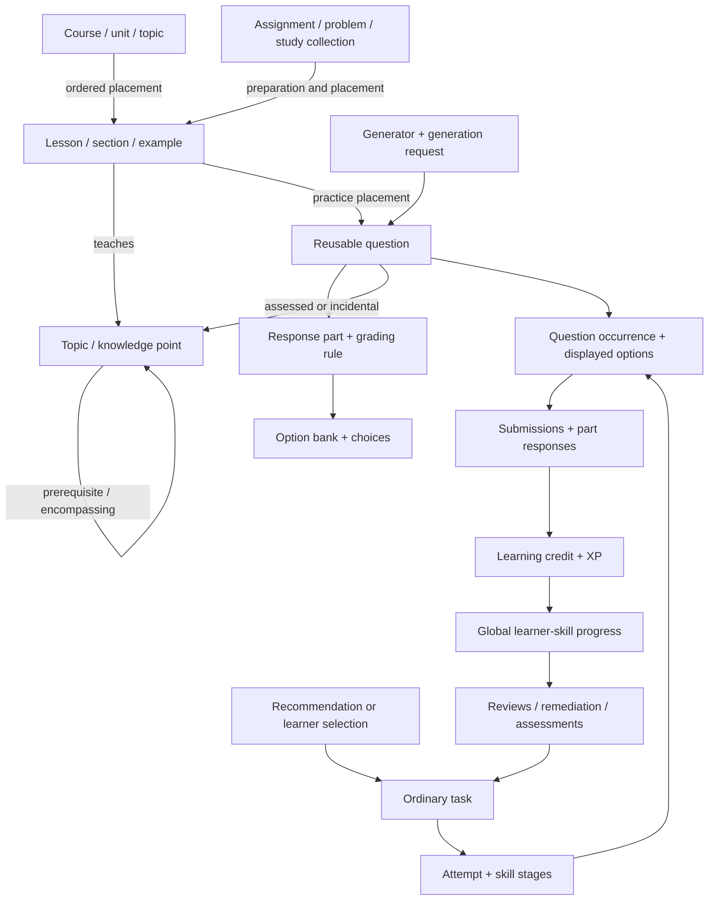

# Course Academy: proposed EDB schema

This is a clean schema for the system we want to build. It describes current content, its pedagogical relationships, learner activity and state, and content generation. It does not include content revision trees, competing source copies, or migration machinery.

The proposal contains **308 attributes and 39 entity specifications**. Every attribute has an EDB `:db/doc` describing its meaning, units, reference target, or allowed vocabulary. Those comments are part of the installable schema and are the detailed field reference.

| File | Purpose |
|---|---|
| [01-attributes.edn](01-attributes.edn) | Actual EDB attribute declarations: types, cardinalities, identities, indexes, and documentation. Install first. |
| [02-entity-specs.edn](02-entity-specs.edn) | Entity kind identifiers and minimum required-field specifications. Install second. |
| [examples/01-content.edn](examples/01-content.edn) | Optional synthetic curriculum, lesson, school problem, and all seven question formats. |
| [examples/02-learning.edn](examples/02-learning.edn) | Optional synthetic learner with concurrent enrollments, a completed manual lesson, earned credit, XP, review, and a timed assessment. |
| [validate.sh](validate.sh), [validate.rs](validate.rs) | Execute the schema and examples against EDB in memory, with readback and rejection checks. |

Only the first two files create the application schema. The examples are disposable test data, not a migration or a demonstration of a working scheduler. Their scores, intervals, and credits are illustrative; the symbolic evaluator and generator identifiers are placeholders for implementations.

## What EDB changes about the design

EDB is an entity/attribute/value database. An entity is identified by a UUID and acquires attributes; it is not a row confined to one table. Entity specifications give us recognizable models without changing that underlying structure.

All application entities have `:entity/id` and `:entity/kinds`. A lesson, question, or knowledge point keeps the same identity wherever it is used. Titles and course codes are labels, not keys. `:entity/kinds` contains references to the `:kind/*` specification entities. Multiple kinds are possible where all their contracts genuinely apply; ordinary records usually have one.

The schema uses EDB's actual scalar types, refs, cardinalities, unique constraints, composite tuples, and opt-in entity specifications. It does not depend on SQL constraints, Datomic-only directives, arbitrary stored maps, or hypothetical Clojure validators.

EDB's cardinality-many attributes are unordered sets. Ordered relationships therefore use entities with explicit positions:

- `placement` orders content inside a course, topic, lesson, assignment, or other container.
- Response parts and choices have their own authored positions.
- Task items record delivery order, and presented choices record the order the learner actually saw.

Only question-to-response-part and option-bank-to-choice refs use `:db/isComponent`, because those children belong to their owner. Placement targets, questions, assets, examples, and option banks are reusable references. A placement never owns the lesson or question it points to.

Current content is edited in place. Attempts retain submitted answers, displayed choice identities/order, scores, timing, and earned evidence. This proposal does not add snapshots of old question wording or grading rules. EDB's own datom history is a database capability; no application content-version model is layered on top of it.

## Entity map

The four original components remain useful as responsibilities. They share one data model; they need not be four databases or services.

| Responsibility | Entity kinds | Purpose |
|---|---|---|
| Curriculum and instruction | `course`, `unit`, `topic`, `knowledge-point`, `lesson`, `section`, `example`, `placement` | Describe what exists, what it teaches, and how it is presented in order. |
| Questions and rich media | `question`, `response-part`, `option-bank`, `choice`, `grading-rule`, `asset` | Separate reusable items, interaction, accepted answers, and presentation. |
| Schoolwork and study organization | `term`, `course-offering`, `assignment`, `problem`, `study-collection` | Connect school demands to reusable teaching content. |
| Pedagogical graph | `relation`, `question-skill` | Prerequisites, encompassing coverage, and assessed versus incidental skills. |
| Delivery and evaluation | `assessment`, `task`, `attempt`, `attempt-skill`, `task-item`, `presented-choice`, `submission`, `response` | Define tests and record what actually happened during learning. |
| Learner and engine data | `learner`, `enrollment`, `goal`, `progress`, `credit`, `requirement`, `xp-entry`, `policy` | Scope, current knowledge, retention, remediation, actual evidence, and XP. |
| Content production | `generator`, `generation` | Request and validate new questions or retrieved content when existing coverage is insufficient. |



### Curriculum and schoolwork

Courses establish scope; topics and knowledge points are shared across courses. `unit` entities can nest to represent units, modules, chapters, or other curricular groupings. A `placement` carries the contextual label, role, and position, so those groupings do not require separate tables for every naming convention.

A topic groups a concept. A knowledge point names a precise assessable competency. A lesson teaches knowledge points through ordered instructional sections and examples. Neither the lesson nor its worked example is automatically the identity of a knowledge point.

Rich text lives in `:content/body` and specialized fields such as `:example/solution`, `:question/explanation`, and `:grading-rule/reference-answer`. Markdown supports TeX, tables, links, and inline `asset:UUID` references. The default authoring format is Markdown; `:content/format` can explicitly identify HTML or plain text. `:content/assets` lists referenced assets for integrity checks. Image-only choices are valid rich content. Links and their display labels use ordinary rich-text syntax; placement labels supply contextual titles in outlines.

An assignment can represent homework, a lecture exercise, a quiz, an exam, or a lab. Its ordered problems hold shared context and can contain subproblems or reusable questions through placements. A problem may require several lessons, and one lesson may prepare for many problems. Reusing a question in a lesson and an exam creates two placements, not two question identities.

A course offering records the school term and section. Enrollment controls the learner's current course scope. A study collection can combine lessons, problems, assignments, and sections across courses. Optional goals record student priorities and deadlines; they do not introduce a separate mastery or scheduling mechanism.

### Questions and grading

Every question has an interaction format. Response parts identify the individual answers the learner supplies. Each part points to a grading rule and, where relevant, an option bank. Machine-checkable answers are distinct from the reference answer displayed to a learner.

| Format | Representation and publication contract |
|---|---|
| `radio` | One choice response part and exactly one accepted choice in its bank. |
| `checkbox` | One choice response part and a nonempty accepted-choice set; multiple selections are allowed. |
| `blank` | One or more ordered text/math/number parts. `{{part:key}}` placeholders locate the slots in the prompt. Each part has its own grading rule. |
| `free` | An open response with a reference answer and optional rubric. Manual or reveal grading does not imply automatic correctness. |
| `select` | Several response parts using one shared option bank; each part selects one choice. |
| `multi-select` | Several dropdown parts, each using its own option bank and selecting one choice. This format is distinct from checkbox selection. |
| `noodle` | Matching parts to a shared bank. For canonical one-to-one matching, part and choice counts match and correct targets are distinct. |

Choice identities are stable even when their displayed letters change. Authored ordering lives on choices; actual ordering and labels live on `presented-choice` records for each task item and response part. Shuffling does not change the answer key.

Grading supports choice sets, normalized/exact text, numeric tolerances, symbolic expressions, manual evaluation, and answer reveal. Expressions have an explicit evaluator identifier and can include domain assumptions and units. Numeric targets use exact decimal values; symbolic targets handle expressions and rational forms. A numeric grader must define how absolute and relative tolerances combine in its evaluator contract.

Part scores and outcomes remain separate from submission results and the terminal question outcome. Multiple submissions can belong to one occurrence. A partial first submission followed by a correct final answer does not automatically count as two independent learning trials. The delivery/evidence policy decides how hints, retries, answer reveal, time limits, and manual evaluation affect mastery credit.

`question/gated?` expresses an authored preference to hide a prompt until the learner starts it. `question/shuffle-choices?` is also a presentation preference. Effective exam restrictions and evidence rules belong to the task's policy and attempt context.

### Graph meanings

| Relation | Direction | Meaning |
|---|---|---|
| `prerequisite` | Dependent skill/topic/lesson → required node | Baseline eligibility. Cycles are invalid within the prerequisite graph. |
| `key-prerequisite` | Dependent knowledge point → crucial prerequisite | A targeted dependency useful for remediation. It is not a synonym for every prerequisite. |
| `encompasses` | Advanced skill/topic → simpler skill/topic | Practice may provide implicit evidence for the covered node, under the engine's rules. |
| `equivalent` | Node → equivalent node | An equivalence claim for application interpretation, not identity merging. |
| `related` | Node → associated node | Navigation or pedagogy; carries no automatic mastery credit. |

An encompassing weight lies in `[0,1]`. Explicit zero means no coverage; an absent weight means unknown. A prerequisite edge does not acquire full encompassing credit just because it exists. Where a policy calculates coverage from dependencies, an explicit encompassing edge can supply an override.

`question-skill` links separately record assessed and incidental skills, optionally narrowed to a response part. An advanced question can exercise several prerequisites without assessing all of them equally. Graph weights are possible coverage; `credit` records are the evidence actually awarded after learner activity.

### One engine pathway for manual and recommended lessons

A learner-selected lesson becomes an ordinary `task` with `:task/origin :task.origin/learner`. Recommended tasks use `:task.origin/recommended`. The target, attempt structure, grading, XP, learning evidence, retention, and subsequent assessments use the same models.

The intended completion transaction is:

1. Record the final responses, terminal item outcome, stage outcome, and attempt result.
2. Create actual direct, implicit, diagnostic, or failure credit as justified by the evidence and graph.
3. Update the learner's global `progress` entities, including retention anchors and derived scheduling caches.
4. Write signed XP entries and satisfy or create explicit remedial requirements.
5. Complete the task. Future recommendations read that resulting state.

These related writes should be atomic. Stable UUIDs for attempts, submissions, credits, and XP entries must be reused on retries so a repeated completion request does not award evidence twice. EDB identity uniqueness supplies a building block; request handling must also prevent replay from applying aggregate deltas twice.

The schema does not equate opening a lesson with meeting its prerequisites or earning review credit. Eligibility and recommendation are separate decisions. Selecting an eligible lesson changes how it enters the engine; it does not create an alternate completion path.

`attempt-skill` records track the learner's place and correct/error streaks within a particular task. `progress` records describe the learner's current knowledge across all attempts. A composite unique constraint on `(learner, skill)` prevents separate progress profiles for the same skill in different courses.

FIRe-shaped state includes a **nonnegative fractional repetition position**, a memory reference value **and reference timestamp**, diagnostic balance, learning speed, last direct practice, and interval/due caches. Credit deltas may be negative or fractional. Baseline mastery, readiness, and automaticity/test eligibility remain distinct.

`progress/review-due-at` is a cache derived from retention state and policy. A `requirement` represents an explicit obligation such as remediation or practice before a retake, not another independent retention clock. An offered task may cover a future requirement, but only qualifying results can satisfy it.

An `assessment` defines a reusable test: fixed question placements, scope, timing, pass criteria, and/or sampling constraints. A concrete assessment task and its attempt record what the learner actually received and how long they had. A retake is another task linked through `task/retake-of`.

XP is an append-only signed ledger. Total and daily XP are calculated from entries, using the learner's time zone. Advertised task XP, earned XP, score, difficulty, and actual elapsed time are independent values.

### Content generation boundary

A generator declares a Python, template, LLM, or retrieval entrypoint, supported skills and formats, parameter constraints, and a validator. A generation request records the inputs, optional seed, state, and validation result. Resulting questions are ordinary content and may point back to that request.

This supports producing additional review and exam questions for a lesson taken ahead of the recommendation schedule. It does not presume that an LLM result is correct or that an identifier already has a working implementation. Publication requires the same content and grading checks as any authored question.

Parameterized values, policy configuration, sampling constraints, and evaluator options use explicitly named `*-edn` **string** attributes. EDB has no native arbitrary map/JSON value. These are extension points for algorithm-specific settings; relationships and essential queryable fields remain normalized. Each consuming implementation must parse and validate its own parameter structure.

## What is enforced, and what still needs application code

| Rule | Enforcement |
|---|---|
| Attribute value type and cardinality | EDB. |
| UUID identity and policy-key identity | EDB unique identity constraints. |
| One progress entity per learner/skill | EDB derived composite with `:db.unique/value`. Both constituents must be present. |
| Minimum fields for a declared kind | EDB **when the write explicitly requests `:db/ensure`**. Tagging a kind alone is insufficient. |
| Allowed keyword values, ref target kinds, finite numbers, bounds, timing units | Application validation; `:db/doc` describes the contracts. |
| Unique positions/part keys, component ownership, valid placement containment | Application validation. |
| Prerequisite acyclicity, relation semantics, coverage and credit calculation | Graph and engine code. |
| Valid question structure, accepted choices in the applicable bank, correct symbolic/numeric answers | Content validators and grading implementations. |
| Legal task transitions, idempotent completion, learner ownership across evidence, consistent aggregate state | Engine transaction logic. |

Entity specs establish a minimum record shape so drafts can exist. Before marking content ready, validate the full format contract: nonempty usable answers/options, keys and positions unique within their owner, placeholder/part agreement, exactly one answer for radio/dropdowns, matching constraints, resolvable assets, and a working evaluator or an explicit manual/reveal mode. Ready lessons must have coherent targets and instructional content; a title alone is a valid draft, not a usable lesson.

Other essential write rules include:

- Require `:db/ensure` for every declared kind on creates and relevant updates/retractions. Confirm that kind tags match the specs being enforced.
- Distinguish missing facts from explicit zero or false. Do not invent difficulty, encompassing weights, due dates, or answer correctness when unknown.
- Keep each response part owned by one question and each choice owned by one bank. Reuse banks rather than attaching a component choice to multiple owners.
- Validate occurrence/part/choice ownership, submission sequences, final outcomes, and nonnegative elapsed times. A manually graded response may remain ungraded after submission.
- Keep memory and its anchor timestamp together. Recompute retention/readiness caches when their inputs change, and clamp repetition position according to the configured policy.
- Guard semantic edits to content used by an active attempt so answers and option identities cannot change underneath the learner.

No native predicates are installed by this proposal. EDB supports registered predicates, but they need real deployed implementations; naming an imaginary validator in EDN would not implement these rules.

## Install and validate

Apply `01-attributes.edn` and then `02-entity-specs.edn` as separate EDB transactions. An entity spec must exist before a later write can ensure it. Schema installation itself creates no courses, questions, or learner records.

For same-transaction references, use string tempids. Use `[:entity/id #uuid "..."]` lookup refs for entities already present in the prior database value. With cardinality-many refs, wrap lookup refs in an outer collection, for example `:lesson/topics [[:entity/id #uuid "..."]]`. The fixtures demonstrate both forms.

Update progress by its stable `:entity/id`. The engine derives `:progress/key`; do not hand-write it. Its uniqueness is a duplicate guard, not automatic upsert from the two constituent fields. Because partial composite keys contain nil slots, always supply both learner and skill and ensure the progress spec in the same transaction.

Run the validation harness from this repository:

```bash
bash schema/validate.sh
```

The script links the locally built EDB library under `/home/jake/Developer/EDB/target/release/deps`. It compiles its test binary in `/tmp`, bootstraps an in-memory EDB database, installs both schema files, applies both example transactions, and checks reads and constraint failures. It opens no PostgreSQL connection and writes no persistent database. `EDB_ROOT` or `EDB_RLIB` can select another compatible build.

Validation establishes that the EDN is accepted by the actual engine and that the represented relationships can be read back. It does not implement or validate FIRe formulas, a scheduler, question graders, or every documented application invariant.

## Evidence behind this proposal

The EDB implementation is the authority for storage behavior:

- [Schema declarations and supported constraints](/home/jake/Developer/EDB/docs/03_schema/00_schema.md).
- [Identity, lookup references, and composite values](/home/jake/Developer/EDB/docs/03_schema/01_identity_and_values.md).
- [EDN transactions and in-memory execution](/home/jake/Developer/EDB/docs/01_tutorials/00_edn_workflow.md).
- [Transaction assessment and entity-spec enforcement](/home/jake/Developer/EDB/src/transaction/assess/mod.rs).

The pedagogical and engine distinctions come from the [engine analysis](../mathacademy_engine_analysis.md), [architecture analysis](../mathacademy_schema_architecture.md), the study [question authoring schema](/home/jake/Developer/study/util/skills/quiz-block-factory/references/quiz-block-schema.md), and the [lesson planning model](/home/jake/Developer/study/util/skills/core-move-lesson/schemas/lesson-plan.schema.json).

This is our proposed implementable schema, not a claim that these are Math Academy's private database fields. Publicly described behavior and observed content constrain the model; exact proprietary functions remain engine work. Source selection and migration planning can be handled after this model is reviewed.
